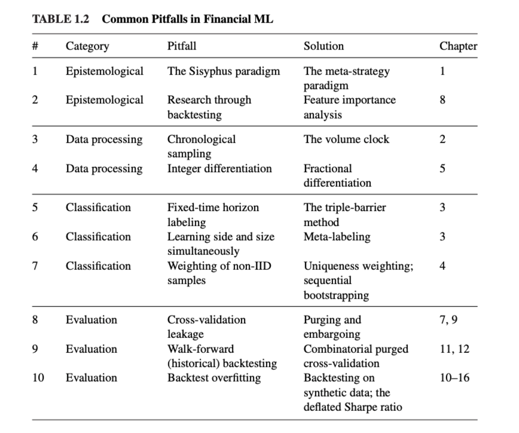

## chapter 0 引言

1. 市场上关于投资的书籍大致分为两类：一类是理论家写的，自己都没有实践过；一类是实践家写的，他们误用了数学工具。
2. 金融市场上现在鱼龙混扎，很多小散户收到不良媒体的诱导会冲动投资，结果造成市场动荡。量化工具可以肃清这种风气，减少这种套利机会。

### 为什么金融领域的机器学习项目经常失败？

有一些导致失败的原因：

1. 西西弗斯范式（Sisyphus Paradigm）：大概是说请了一堆投资人，但是有用的策略很少，导致入不敷出？
2. 元策略范式（Meta-Strategy Paradigm）：构建一个成功的策略和构建100个成功的策略话费的心思一样多。构建一个团队，让成员各司其职，成功率要远大于单兵作战。
3. 常见的陷阱：


4. 是否意味着有了ai就没有human投资者的空间了？不是，可以人+ai

## chapter 2 金融数据结构

1. 金融数据经常分为4类，基本面数据，市场交易数据，分析数据，另类数据（Alternative）

2. 基本面数据包括公司每个季度发布的会计报告，要注意发布时间和统计时间段的区别。
3. 另类数据（Alternative）包括个人数据，商业过程数据，卫星，天气数据。
4. 数据处理，为了让ml方法可用，需要将原始数据处理为表数据（bars）。两种处理方法，标准bar methods和信息驱动的方法。第二种在实践中用的多。
5. 标准bars方法：将不等间隔处理成等间隔数据，很多数据厂商都是提供这种格式。标准bars方法包括Time Bars，Tick Bars，Volume Bars，Dollar Bars

    > 一个tick表示一次成交事件
7. 【Tick Bars】每隔多少笔交易采样一次，属于一种基于信息的采样方法，其理论依据是：固定时间内的价格变化服从方差无限大的Paretian分布；固定交易笔数内的价格变化服从高斯分布。
   
    > Price changes over a fixed number of transactions may have a Gaussian distribution. 
    > Price changes over a fixed time period may follow a stable Paretian distribution, whose variance is infinite. 
    > Since the number of transactions in any time period is random, the above statements are not necessarily in disagreement
    > --Mandelbrot and Taylor 
8. 上面的假设很重要，因为很多统计方法的依赖于假设--样本来自IID高斯过程。
9. 【Tick Bars】构造tick bars要留意异常点，很多交易所在看盘前和收盘后都有竞价（auction），这段时间，order book 积累 bids 和 offers单，并不撮合（match）。当竞价结束，有一笔数量很大的交易会公开，这一笔交易可等价于成千上万个ticks，虽然现实的是一个tick。
10. 【Volume Bars】tick bars的缺陷在于，真实情况下，我们下的一笔单子会被拆分成多笔交易去成交。因此看到的tick比我们实际下的tick变多了。Volume bars可以解决这个问题，他是按照一定证券价值变动的时间段，进行抽样。举个例子，we could sample prices every time a futures contract exchanges 1,000 units, regardless of the number of ticks involved.
11. 【Dollar Bars】每隔一段时间，市场上交易价值达到某个给定值（bar size），就进行抽样，the bar size could be adjusted dynamically as a function of the free-floating market capitalization of a company (in the case of stocks), or the outstanding amount of issued debt (in the case of fixed-income securities)
12. tick bars， volumn bars， dollar bars 三者对比： If you compute tick bars and volume bars on E-mini S&P 500 futures for a given bar size, the number of bars per day will vary wildly over the years. That range and speed of variation will be reduced once you compute the number of dollar bars per day over the years, for a constant bar size. 结论是前面两者每天的变动范围和变动速度，要远高于dollar bars
   
13. 信息驱动的bars，目的在于，当有信息到达时，采样更频繁。信息驱动bars有几种方法：Tick Imbalance Bars，Volume/Dollar Imbalance Bars，Tick Runs Bars，Volume/Dollar Runs Bars
14. 【Tick Imbalance Bars】背后的想法是只要tick数据超过我们的期望，就去采样。这样设置index，累计的交易信号超过某个阈值，没看懂
15. 【Volume/Dollar Imbalance Bars】？
16. 【Tick Runs Bars】？
16. 【Volume/Dollar Runs Bars】？
14. 处理多产品序列：The ETF Trick、PCA Weights，Single Future Roll
    ```python
    def pcaWeights(cov,riskDist=None,riskTarget=1.):
        # Following the riskAlloc distribution, match riskTarget
        eVal,eVec = np.linalg.eigh(cov) # must be Hermitian              
        indices = eVal.argsort()[::-1] # arguments for sorting eVal desc
        eVal,eVec=eVal[indices],eVec[:,indices]
        if riskDist is None:
            riskDist=np.zeros(cov.shape[0])
            riskDist[-1]=1. 
        loads=riskTarget*(riskDist/eVal)**.5 
        wghts=np.dot(eVec,np.reshape(loads,(-1,1))) 
        #ctr= (loads/riskTarget)**2*eVal # verify riskDist 
    # return wghts
    ```
17. 直接让ml预测涨跌很难， after certain catalytic conditions算法会更容易表现好。
18. 对特征进行采样的方法-Event-Based Sampling，其中一种方法叫The CUSUM Filter，利用CUSUM可以构造交易策略（Fama and Blume [1966]的filter trading strategy），同事也可以用来采样：当累计收益$S_t$超过某个阈值时，进行采样，并将$S$置为0，

```python
import pandas as pd
def getTEvents(gRaw,h): 
    # gRaw： raw time series
    # h: thresh
    tEvents,sPos,sNeg=[],0,0 
    diff=gRaw.diff()
    for i in diff.index[1:]:
        sPos,sNeg=max(0,sPos+diff.loc[i]),min(0,sNeg+diff.loc[i]) 
        if sNeg<-h:
            sNeg=0
            tEvents.append(i) 
        elif sPos>h:
            sPos=0
            Events.append(i) 
    return pd.DatetimeIndex(tEvents)
```
19. $S_t$可以是structural break statistics, entropy, or market microstructure measurement。比如，我们可以定义一个时间，之哟啊r SADF远离之前的取值足够远。
20. 使用event-based的方法获得了一个子集之后，可以让ml算法来分析，这些特殊事件有没有蕴含一些有值得决策的信息。


## chapter 3 标记

> 在监督学习中，需要输入label，那么在金融领域，如何定义label？


### 固定时间段方法

1. 大部分论文都是采用的这个方法，即固定的一段时间收益率是否超过/低于某个取值。
    
2. 虽然大部分人这么用，但是这个方法跟固定时间段采样有一样的毛病，就是固定时间段内的样本并不服从gaussian分布。第二个缺陷是，这个阈值是固定的，无视当前市场波动率的变化，可能会导致错失很多有价值的正样本。
3. 有更优的标记方法：动态阈值（类似异常检测）和  volume /dollar bars（波动率更固定）， 
4. 即使改进了fixed time 和 fixed thresh，还有一个很显现实的问题就是，要考虑到价格路径，如果在半路触发margin call，那么预测得再准也没有用。


### 3重障碍方法

1. 三重障碍方法是这样的，首先设置2个水平障碍和1个垂直障碍。2个水平障碍是基于变动的日波动率算出来的，1个垂直障碍是说，离上一次position take，经过了bars的个数。
2. 如果upper障碍最先触发，返回1；如果lower障碍最先触发，返回-1；如果垂直的障碍触发，返回-1/+1，或者0，具体情况具体分析.三重障碍方法是路径依赖的标记方法。
```python
def applyPtSlOnT1(close,events,ptSl,molecule):
    # apply stop loss/profit taking, if it takes place before t1 (end of event)
    events_=events.loc[molecule] 
    out=events_[['t1']].copy(deep=True)
    if ptSl[0]>0:
        pt=ptSl[0]*events_['trgt'] 
    else:
        pt=pd.Series(index=events.index) # NaNs
    if ptSl[1]>0:
        sl=-ptSl[1]*events_['trgt'] 
    else:
        sl=pd.Series(index=events.index) # NaNs
    for loc,t1 in events_['t1'].fillna(close.index[-1]).iteritems():
        df0=close[loc:t1] # path prices df0=(df0/close[loc]-1)*events_.at[loc,'side'] # path returns out.loc[loc,'sl']=df0[df0<sl[loc]].index.min() # earliest stop loss. out.loc[loc,'pt']=df0[df0>pt[loc]].index.min() # earliest profit taking.
    return out
```
### 学习SIDE和SIZE

1. 这种标记可以让ml算法从side和size中学习到一些信息
2. 如果没有side信息，我们没法区分profit-taking 障碍 和 stop-loss 障碍。

### META-LABELING

### 如何使用META-LABELING

### 量化 + 基本面方法

THE QUANTAMENTAL WAY

### 丢掉不必要的label

it is preferable to drop extremely rare labels and focus on the more common outcomes.

## chapter 4 样本权重

大部分ML算法都是基于IID假设，而金融时序不是IID的，所以大部分ml应用直接套用到金融场景会失败。 

## chapter 5 部分差分特征

分数差分特征--Fractionally Differentiated Features

### STATIONARITY VS. MEMORY的两难问题
1. 金融序列大部分非平稳，且有很低信噪比，标准的平稳变换，例如差分变换，会丢失信息。
2. 价格序列有记忆，但是查分后的序列没有记忆了。
3. 接下来理论家们会从剩下的残差信号中使用各种fancy的工具去提取信息。
4. 金融序列不平稳的原因是，它有很长的记忆.所以要使用传统的方法的话要做invariant processes，例如看价格的收益率或者取对数差，波动性变化
5. 在信号处理中，我们是不希望所有的记忆都被抹除的，因为记忆是信号模型的basis。例如，均衡平稳模型需要一些记忆，来获取截止目前为止，结果偏离长期预测值多远，来预测。矛盾在于，收益是平稳的，但是没有记忆。价格有记忆，但是不是平稳的。
那么问题就来了：最小的差分阶数是什么？既能满足一个价格序列平稳，又能保留尽可能多的信息？
6. 协整（cointergration）方法可以使用记忆来建模。
7. 平稳性只是ml算法的必要不充分条件，但是通过差分变换的方法虽然获得了平稳性却丢失了记忆性，会导致ml基本上没有什么记忆能力。

下面会介绍一些转换方法，在保留记忆的同时，又能实现平稳变换。


### 分数差分方法
1. 如何解决平稳和两难的问题？已有paper提出了分数差分的方法。（Hosking [1981]），分数差分过程展现出了长期的记忆


### 5.5.1 Expanding Window
#### 5.5.2 Fixed-Width Window Fracdiff


## 参考
1. 《Advances in Financial Machine Learning》
2. https://blog.csdn.net/weixin_38753422/article/details/100179559