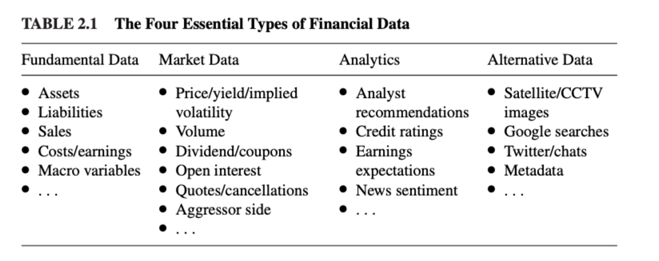

1. 市场上关于投资的书籍大致分为两类：一类是理论家写的，自己都没有实践过；一类是实践家写的，他们误用了数学工具。
2. 金融市场上现在鱼龙混扎，很多小散户收到不良媒体的诱导会冲动投资，结果造成市场动荡。量化工具可以肃清这种风气，减少这种套利机会。

### 为什么金融领域的机器学习项目经常失败？

有一些导致失败的原因：

1. 西西弗斯范式（Sisyphus Paradigm）：大概是说请了一堆投资人，但是有用的策略很少，导致入不敷出？
2. 元策略范式（Meta-Strategy Paradigm）：构建一个成功的策略和构建100个成功的策略话费的心思一样多。构建一个团队，让成员各司其职，成功率要远大于单兵作战。
3. 常见的陷阱：

Does that mean that there is no space left for human investors?
Not at all. No human is better at chess than a computer. And no computer is better at chess than a human supported by a computer. Discretionary PMs are at a disad- vantage when betting against an ML algorithm, but it is possible that the best results are achieved by combining discretionary PMs with ML algorithms. This is what has come to be known as the “quantamental” way. Throughout the book you will find techniques that can be used by quantamental teams, that is, methods that allow you to combine human guesses (inspired by fundamental variables) with mathematical forecasts. In particular, Chapter 3 introduces a new technique called meta-labeling, which allows you to add an ML layer on top of a discretionary one.

## 参考
1. 《Advances in Financial Machine Learning》