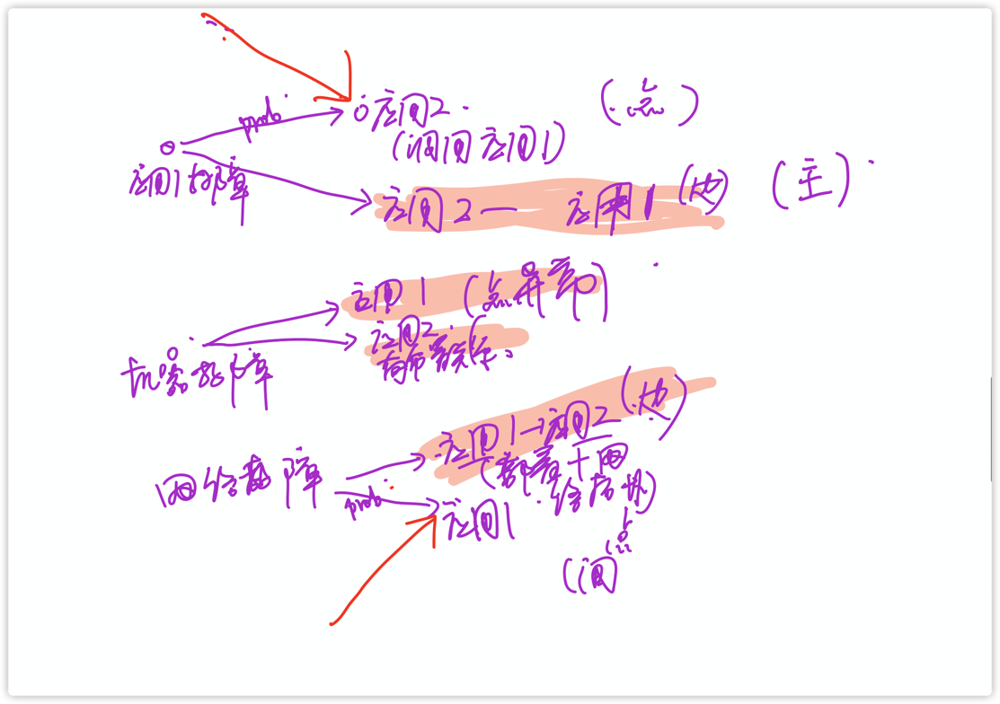
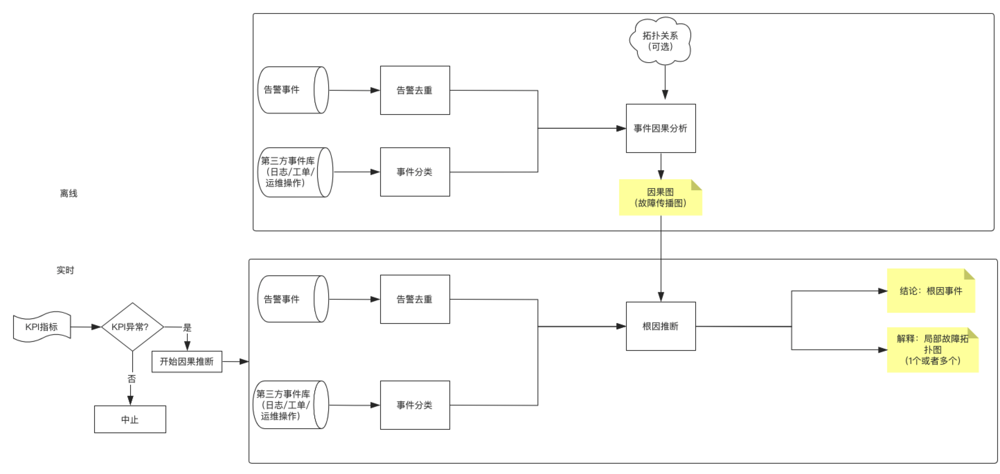

# 问题分析 和 方案设计

一个IT系统包括机器，网络，应用。

一个系统中任何一个组成部分都有可能出现故障，从而导致系统瘫痪。

为了减少故障带来的损失，我们需要提前制定预案，即哪些表象对应这哪些故障，从而在故障发生时候，能快速地根据表现识别出故症结所在，进而进行故障处理。

下面对这个解决方案进行说明。

## 因果图-故障传播图

从表象推断出故障症结，可以表达为一个因果推断的需求，即「由果推因」。

从众多的监控指标，日志信息，事件信息，归纳出导致这些现象出现的原因。

先分别看故障出现在这三层会出现什么表现（演绎），以及用什么方法去根据表象推断根因（归纳）

- 应用之间在逻辑上存在调用关系，应用可能存在一台机器上，也可能是跨机器甚至跨网络。
- 应用是部署在机器上的，应用之间的调用关系，实际上会映射为机器之间的网络连接关系。
- 应用层故障：如果某个服务异常了，那么所有依赖它的服务的响应时长都会变长。举个例子，如果某个服务b 调用服务a，现在服务a异常了（比如某个操作系统死机了，或者mysql的请求堵塞了）， 就会表现出
  - b服务的响应时间变长；a服务的响应时间变长
  - b服务的响应时间进行下钻分析，可以发现b服务依赖的其他服务的响应时间没有异常，只有依赖a服务的响应变长了。
  - 对a服务的响应进行下钻分析，发现a服务依赖的所有的服务响应时常都是正常的。
  - 如果服务c 要 调用服务b，然后这个调用并没有用到服务a，服务b的反应就是正常的。
  总结一下，每一个服务的健康度是一个量化指标，被调用的成功率，如果成功率低，说明这个服务自身可能异常，也有是依赖服务异常导致。
- 主机故障：如果某台机器故障，那么部署在这台机器上的所有应用都危险了，进而间接影响到，调用这些应用的调用方，即导致应用的点异常，以及间接导致边异常。
- 网络故障：网络故障比如网络设备（网线，机房，交换机，路由器）故障，会导致数据在传输过程中丢失，进而影响到两个跨机器的应用之间的调用，即导致 边异常。

画一个图表示一下

## 根因定位方案&工作流图

[流程图-腾讯文档](https://docs.qq.com/flowchart/DVGJiQ0NXc2Z3dGVq)

## 关于事件的定义

事件的定义确定了rca的定位能力的颗粒度。
事件定义的粒度越粗糙，定位到的根因就越粗糙，起到的作用就越少。

粗糙的事件描述只能定位到粗糙的根因。
事件详细到指标的描述，件可以定位到机器的指标根因。
事件详细到指标的描述，件可以定位到细粒度的根因，

怎么定义一个事件？
使用 [机器ip, 服务名称, 事件类型/指标名称]

## 要用到那些数据？

要用到的数据包括：日志，指标，事件以及拓扑数据

但是每条日志/指标/事件，一定是跟一个实体绑定的（某个主机或者某个主机的某个应用）。

先定位到有问题的实体，然后下钻分析，该实体的哪个指标为根因。

如何确定一个实体是健康还是异常？两个思路：

- 定义应用/中间件的通用的SLO指标，比如调用成功率，调用耗时。
- 定义每个应用/中间件最适合的SLO指标，如db最关心锁个数，是否关闭监听。

此外，还需要用到调用拓扑数据，即服务之间的相互调用关系，或者服务所部署的机器之间的关系，最终得到一个精确的方案。

## 构造因果图

先要确定这个因果图的skeleton，有哪些节点，什么方向。
构建因果图的skeleton：基于服务调用关系以及其他的先验，基于数据分析因果关系，提取最大子图。
因果图长什么样子：

构建因果图（causality graph）是一个核心技术点。

- 因果图是一个两层分层的图（two layered hierarchical causality graph）

  - 较高的层是粗粒度的信息，表示每台机器上每个服务间的依赖关系，也叫服务依赖图（Service Dependency Graph），用于定位到服务级别的cause。
  - 较低的层是细粒度的信息，表示系统指标组成的细粒度因果关系，也叫指标因果图（Metric Causality Graph），用于定位到指标。

- 构造「服务依赖图」分为两步（就是调用关系）：第一步通过采集器获取边是否存在；第二步通过分析两个服务间的通信延迟相关性（traffic lag correlation）来进一步确定边的方向。

- 构造「指标因果图」：使用人工经验+PC算法。 

  > pc算法是一种发现因果关系的算法，在满足一定的假设前提下，使用的基于统计的方法，推导出因果关系。

## 使用因果图进行推断

当前端的服务可用性指标（SLO）出现异常，就会触发根因分析

一边定位调用链中的异常服务，一边下钻

- 首先：找到异常的服务
- 其次：找到服务所在的机器，搜集性能指标，对指标因果图进行深度优先搜索 ，推断本地是哪个指标导致服务性能问题。
- 问题： 如果问题是别人造成的，就去找别人的问题：如果根因指标是依赖服务的SLO（注意，用到了调用链关系），这个推断就会继续，传播到远程的依赖的服务。
  一直追本溯源，一直到最底层的被调用方，即物理层。

先定位调用链中异常服务，最后下钻

- 定位到有故障的服务
- 再去下钻分析，指标层面的故障

# 验证方案的可行性

## 1. 调用链路根因分析

## 2 AIOps挑战赛

1. AIOps挑战赛2020-获奖方案分案
2. AIOps挑战赛2021-demo方案

# 参考资料

1. [知乎-关于因果推断](https://zhuanlan.zhihu.com/p/88173582)
2. [根因推断的英文原文](http://www.stat.cmu.edu/~larry/=sml/Causation.pdf)
6. [AIOps挑战赛2020-官网](http://iops.ai/competition_detail/?competition_id=15&flag=1)

