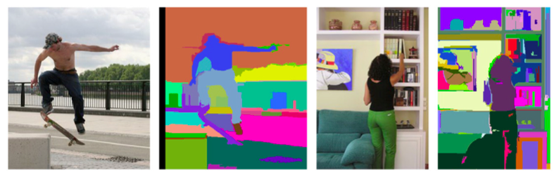

> 除了kmeans，聚类算法中还有一类更简单直观的方法，就是层次聚类。

# 目前常用聚类算法

目前常用的聚类算法大概分为三类：

- 层次聚类： nearest neigbour
- 基于分区的聚类（partitional）：Kmeans系列/FCM/图理论
- 密度：
- 其他：ACODF

## 层次聚类

层次聚类算法,又称为树聚类算法,它使用数据的联接规则,透过一种层次架构方式,反复将数据进行分裂或聚合,以形成一个层次序列的聚类问题解.

本文仅以层次聚类算法中的层次聚合算法为例进行介绍.

层次聚合算法的时间复杂度为$O(n^2)$,适合于小数据集的分类. 

该算法由树状结构的底部开始逐层向上进行聚合,假定样本集S={o1,o2,...,on}共有n个样本.

1. 初始化：每个样本 $o_i$ 为一个类; 共形成 n 个类:$o_1,o_2,...,o_n$
2. 找最近的两个类：从现有的所有类中找出距离最近(相似度最大)的两个类 $o_r$ 和 $o_k$
   $$distance(o_r,o_k) = min_{\forall{o_u,o_v \in S,o_u \neq o_v}}distance(o_u,o_v)$$
3. 合并$o_r$和$o_k$: 将类$o_r$和$o_k$合并成一个新类$o_{rk}$; 现有的cluster个数减1
4. 若所有的样本都属于同一个类,则终止本算法;否则,返回步骤2.

层次聚类最大的优点，它一次性地得到了整个聚类的过程，只要得到了上面那样的聚类树，想要分多少个cluster都可以直接根据树结构来得到结果，改变cluster数目不需要再次计算数据点的归属。

层次聚类的缺点是计算量比较大，因为要每次都要计算多个cluster内所有数据点的两两距离。

另外，由于层次聚类使用的是贪心算法，得到的显然只是局域最优，不一定就是全局最优，这可以通过加入随机效应解决，这就是另外的问题了。

## 基于Graph的聚类

基于Graph的聚类算法，大致思路是，计算样本两两之间的相似度，并设定阈值，高于阈值就右边，低于阈值就无边，以此构造有权无向图，权重即为相似度。

### 谱聚类

谱聚类的流程是：

输入：n个样本, 类别k

1. 根据样本两两之间的相似度，构建有权无向图，以及邻接矩阵W。
2. 计算出拉普拉斯矩阵L，对L做谱分解（相当于降维）：计算拉普拉斯矩阵L的最小的k个特征向量u1, u2,...,uk,将这些向量组成n*k维的矩阵U,
3. 将U中的每一行作为一个样本，共n个样本，使用k-means对这n个样本进行聚类

得到簇划分C(c1,c2,...ck).

### 如何判断两个cluster之间的距离？

一开始每个数据点独自作为一个类，它们的距离就是这两个点之间的距离。而对于包含不止一个数据点的cluster，就可以选择多种方法了。最常用的，就是average-linkage，即计算两个cluster各自数据点的两两距离的平均值。类似的还有single-linkage/complete-linkage，选择两个cluster中距离最短/最长的一对数据点的距离作为类的距离。个人经验complete-linkage基本没用，single-linkage通过关注局域连接，可以得到一些形状奇特的cluster，但是因为太过极端，所以效果也不是太好。

## 聚类应用

从某种意义上说，层次聚类是一个大的框架，而基于图的图像分割是在图像分割上多加了骨头，使他更适用于图像分割的领域，而使用者可以在骨头上继续加肉来达到不同的分割效果。

### 日志分析

### 图像分割

图像的分割是图聚类的其中一个应用场景。把图像中的每一个像素点看成是一个item，那么图像分割的任务就是将所有的items进行聚类，属于一个类里面的所有像素就构成了一个区域，最终的分割结构就是若干个区域组成的。由此我们过渡到本文的第二部分，基于图的图像分割算法。

怎样利用上述的定义，在基于图的表示方法下，做出高效而准确的分割呢？主要流程如下

输入一个图$G=(V,E)$，有n个点和m个边。输出是一个分割V，分割成$S=(C_1,...,C_2).$

1. 对边E进行排序，生成非递减的序列$\pi = (o_1,...,o_m)$
2. 从初始分割$S^0$开始，每一个点$v_i$自己就是一个区域
3. 对于每一个边$q = 1,...,m$重复步骤3，通过$S^{q-1}$构建$S^q$，使用如下的方式
   
    - 令$v_i$和$v_j$表示按顺序排列的第q条边的两个点，比如$o_q = (v_i,v_j)$。
    - 如果$v_i$和$v_j$在$S^{q-1}$中连个不同的区域下，并且$w(o_q)$比两个区域的内部差异都小，那么合并这连个区域，否则什么也不做。
    - 用公式来表达就是：
      - 令$C_{i}^{q-1}\)是\(S^{q-1}$的一个区域，它包含点$v_i$；令$C_{j}^{q-1}\)是\(S^{q-1}$的一个区域，它包含点$v_j$。
      - 如果$C_{i}^{q-1} \neq C_{j}^{q-1}$ 并且$w(o_q) \leq MInt(C_i^{q-1},C_j^{q-1})$，那么通过合并$C_{i}^{q-1}$和$C_{j}^{q-1}$得到了$S^q$；
      - 否则的话$S^q = S^{q-1}$，返回$S = S^m$

图像分割结果如下

# 参考

1. [一种基于图结构的日志聚类算法](https://patentimages.storage.googleapis.com/34/c0/df/3417293b1602a5/CN105468677A.pdf)
2. [常用聚类算法综述](https://zhuanlan.zhihu.com/p/78382376)
3. [从层次聚类到Graph-based图像分割](https://buptjz.github.io/2014/04/21/cluster)
4. [聚类算法](http://www.jos.org.cn/1000-9825/19/48.pdf)