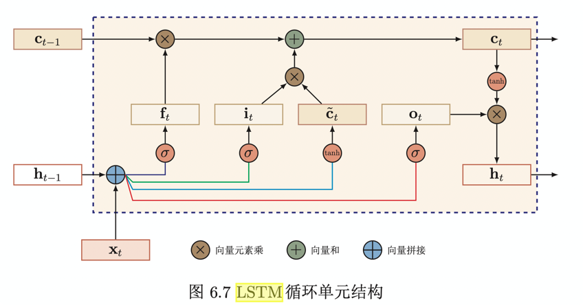
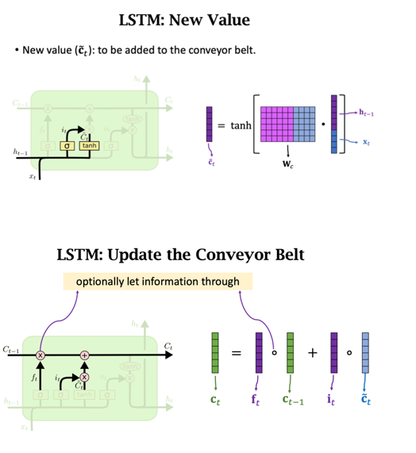

## 总结

1. LSTM是一种RNN模型，是对Simple RNN的一种改进，为了避免长期的梯度消失问题。
2. LSTM也可以看成一个带状态的函数，输入当前词的embedding向量（维度为m）和上一个时刻的状态向量（h维）和上一个时刻的记忆单元向量（h维），输出当前时刻的状态向量（h维）和当前时刻的记忆单元向量（h维）。
3. LSTM通过引入一个传输带（conveyor belt）来缓解梯度消失的问题。过去的信息通过传输带到达下一个时刻，不会发生很大变化。
   
## LSTM

LSTM引入新的内部状态专门进行先行的循环信息传递，同时将非线性加工后的信息给隐藏层的外部状态

lstm有3个门，分别为输入门，输出门，遗忘门，也是三个权重向量

- 输入门：一个权重向量，控制当前时刻的候选状态$\(\mathbf{C}_{t}\)$有多少信息要保留
- 输出门：控制当前内部状态$\tilde{\mathbf{c}}_{t}$有多少信息要输出给外部状态
- 遗忘门：一个权重向量表示上一个时刻的内部状态$\mathbf{c}_{t-1}$需要遗忘多少信息

更新当前记忆

更新当前时刻的state

lstm的参数个数：

三个门参数 + 记忆单元参数: (dim(x) + dim(h)) ✖ dim(h) ✖4

## LSTM应用-情感判断

## cnn 和 rnn视觉对比

有两个图还蛮有意思的，

## cnn vs rnn vs attention

 

## 参考资料
1. [a-comparison-of-dnn-cnn-and-lstm-using-tf-keras](https://towardsdatascience.com/a-comparison-of-dnn-cnn-and-lstm-using-tf-keras-2191f8c77bbe)
2. [dive into deep learning-lstm](https://zh.d2l.ai/chapter_recurrent-neural-networks/lstm.html)
3. [wangshusen-RNN-youtube](https://www.youtube.com/watch?v=Cc4ENs6BHQw&list=PLvOO0btloRnuTUGN4XqO85eKPeFSZsEqK&index=3)
4. [wangshusen-slide-github](https://github.com/wangshusen/DeepLearning)
5. [神经网络与深度学习](https://nndl.github.io/nndl-book.pdf)