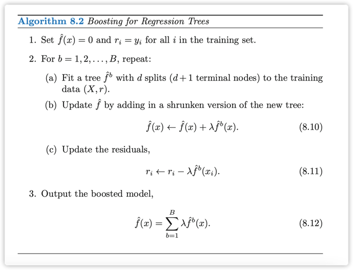

> boosting tree的代表是gbdt，以及一系列变形xgboost,catboost,下面重点介绍一下xgboost

## high-level理解

1. GBDT是一种data-driven的预测方法。
2. GBDT的预测逻辑，分两个层次，第一层，保证每一个样本的准确率；第二层，构造决策路径，即希望通过特征来达到第一层的准确率。实现第一层目的的方法是基于梯度确定阶段性目标；实现第二层的目的的方法通过特征去拟合阶段性目标（残差），也就是cart。

### Adaboost, GBDT 与 XGBoost

1. Adaboost是GBDT的一个特例
2. XGB在GBDT的基础上引入了二阶导数，并且在loss中加入了正则项。

## 算法细节

boosting中有三个重要的参数：
- 树的棵树
- $\lambda$: 学习速率
- 每一棵树的最大splits个数

### 公式推导

### 代码实现

## 参考资料
1. [youtube-gbdt](https://www.youtube.com/watch?v=2xudPOBz-vs)
2. [xgboost](https://arxiv.org/pdf/1603.02754.pdf)
3. [An Introduction to Statistical Learning](https://static1.squarespace.com/static/5ff2adbe3fe4fe33db902812/t/6062a083acbfe82c7195b27d/1617076404560/ISLR%2BSeventh%2BPrinting.pdf)