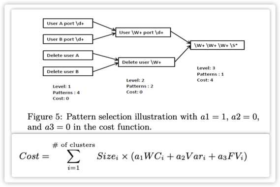
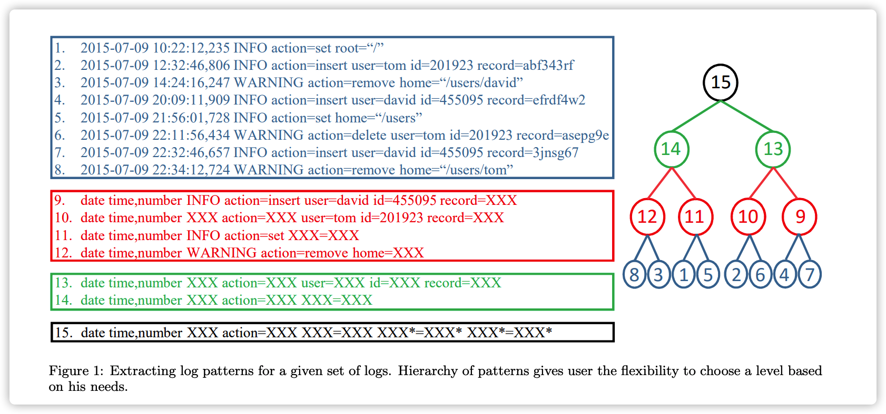
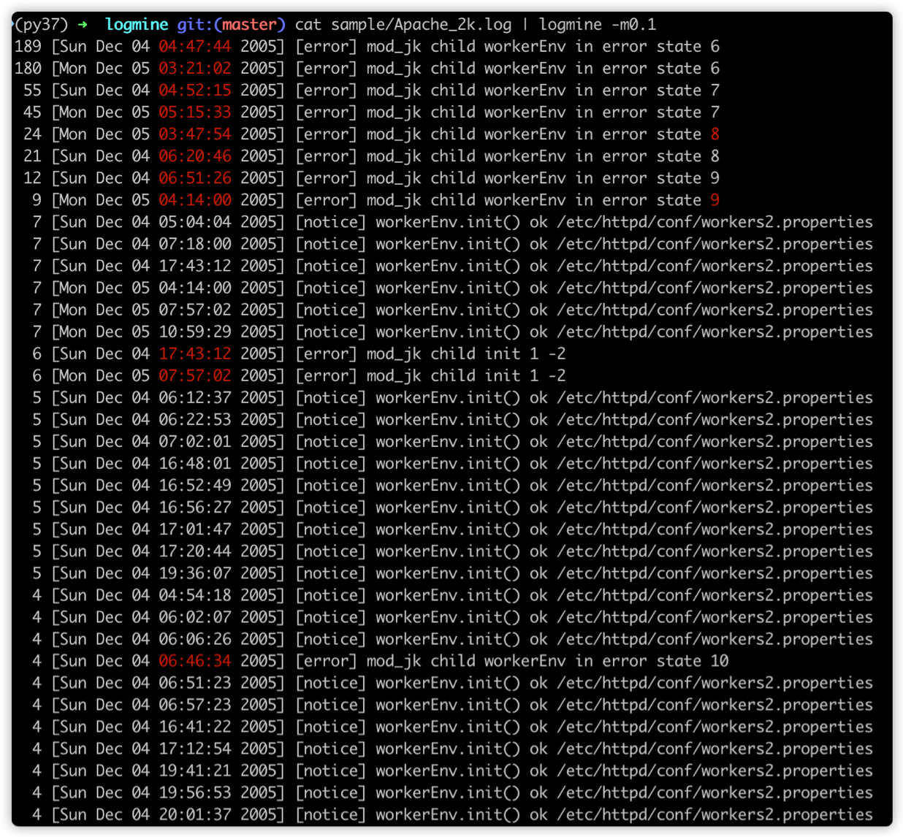

> 日志聚类本质上是在简洁性和信息丰富性之间trade-off。
> 
> 原始日志信息量爆炸，简洁性不够，所以要归纳, 要抽象，得到日志模版。

## 问题描述

将不同来源的日志汇总分析，合并相似的日志，并且对每一类输出摘要，这个摘要就是日志模式（pattern）。


## 解决方案

logmine使用的是基于聚类的方法，做日志摘要生成。

主要思路是，一边构建cluster，一边提取pattern

### 找cluster

- 先定义一个参数MaxDist， 表示cluster的半径
- 对于一个新的日志，如果跟已有的cluster 距离都很远（半径之外），就创建一个新的cluster，并且以他为中心。
  
	> 为了提升效率，判断是否属于某个cluster时使用early abandon的策略，如果已对比的字段累计距离超过了半径，这句话的词还没遍历完，可以提前停止了，距离只会越来越大。

### 对于每个cluster，提取pattern


- step1. 字段类型检测：将可变字段进行泛化，比如date，time，IP，数字，举个例子，将2015-07-09替换成date。这个模式和正则表达式可以让用户定义。
- step2. 分词，每条日志都得到一个word vector.
- step3. 一边聚类 一边提取pattern


### 怎么设置level？



怎么设置level？看每个level的信息损失程度，这里用cost function表示，值越大，表示丢失的信息越多

$$\text { Cost }=\sum_{i=1}^{\# \text { of clusters }} \text { Size }_{i} \times\left(a_{1} W C_{i}+a_{2} V a r_{i}+a_{3} F V_{i}\right)$$

- ${Size}_i$: 第i个pattern包含的日志个数，
- ${WC}_i$: 第i个pattern，**的个数，对应权重a1，默认取1
- ${Var}_i$:第i个pattern，变量的个数，对应权重a2，默认取0
- ${FV}_i$: 第i个pattern，固定值的个数，对应权重a3，默认取0


提取层次化模式，参考下图





### 衡量两条日志的相似性

衡量两条日志相似性的函数：

$$\operatorname{Dist}(P, Q)=1-\sum\limits_{i=1}^{\operatorname{Min}(\operatorname{len}(P), \operatorname{len}(Q))} \frac{\operatorname{Score}\left(P_{i}, Q_{i}\right)}{\operatorname{Max}(\operatorname{len}(P), \operatorname{len}(Q))}$$

$$\operatorname{Score}(x, y)=\left\{\begin{array}{cl}k_{1} & \text { if } \mathrm{x}=\mathrm{y} \\ 0 & \text { otherwise }\end{array}\right.$$

- $P_i$：日志P的第i个字段，len(P): 日志P的字段的个数。
- $k_1$: 如果两个字段一样，得$k_1$分，默认值为1。

### 衡量两个pattern的相似性

pattern 长什么样呢？ 每个pattern有三类字段：fixed value， Variable 和 Wildcard

- 固定值（fixed value field ）：如www, httpd, INFO ，有明确含义的，固化的。
- 可变字段（A variable field）：如IP地址，邮箱，数字，日期，属于一个具体的类型，但是取值是可变的，需要用户定义name和regex。
- Wildcards ：任意的字段,就是**。

衡量两个pattern相似性的函数（不同类型的word给的权重不一样）：

$$\text { Score }(x, y)=\left\{\begin{array}{cl}k_{1} & \text { if } \mathrm{x}=\mathrm{y} \text { and both are fixed value } \\ k_{2} & \text { if } \mathrm{x}=\mathrm{y} \text { and both are variable } \\ 0 & \text { otherwise }\end{array}\right.$$

- $k_1$: 如果两个fixed value字段一样，得$k_1$分，默认值为1
- $k_2$: 如果两个变量字段一样，得$k_2$分，默认值为2

### 怎么评估效果？

整个问题的评估可以拆分为两个小评估:

- 评估聚类的准确率？
- 评估模式的准确率？

因为没有标签，所以聚类和评估都是跟baseline比

> 都有了baseline，还要你这个算法干嘛？可能logmine的性能有优势？

- 聚类效果跟baseline--OPTICS对比: 看最大公共子集的比例（原文中的agreement score）。
- 模式效果跟baseline--UPGMA比：UPGMA的结果作为ground truth，比较recall和precision.
  	
	> UPGMA算法的输入一批原始日志，输出是一个patten

$\text { Total Accuracy }=\sum\limits_{i=1}^{\# \text { of clusters }}\left(A c c_{i} \times \text { Size }_{i}\right) \div \sum\limits_{i=1}^{\# \text { of clusters }} \text { Size }_{i}$

## chiechie's对logmine的总结

论文看完了，代码也跑了一遍，发现有几个问题：

1. 所谓的不需要人工干预，没有做到。很重要的一个功能就是从原始文本中提取variable类型的字段（field），需要人指定variable的name以及正则匹配规则。否则代码是不会主动帮你探测的。

2. 不同的cluster的pattern可能存在如下的父子关系
	```markdown
	pattern36 : datetime dms_frontend_mng.cpp 197 OnProcessFromClient D DMS update time stamp *** *** from *** to ***
	pattern50:  datetime dms_frontend_mng.cpp 197 OnProcessFromClient D DMS update time stamp *** *** from *** to ***
	pattern53:  datetime dms_frontend_mng.cpp 197 OnProcessFromClient D DMS update time stamp 1c7c49d5 11024333 from *** to ***
	pattern64:  datetime dms_frontend_mng.cpp 197 OnProcessFromClient D DMS update time stamp *** *** from *** to ***
	```
 	
	> 每个cluster的中心是第一个进入到该cluster的日志的log-signature。
	> 能归到这个cluster的日志都跟中心的距离在maxdist以内。这有一个问题，有一些日志虽然跟该cluster的中心相距较远，但是提取出的pattern可能又很接近.

3. 2的解决方案：
	1. 对于每个cluster提取pattern时，只保留最抽象的一层
	2. 所有的cluster构建完之后，将存在父子pattern的cluster合并。


## 参考资料

1. [logmine-paper](https://www.cs.unm.edu/~mueen/Papers/LogMine.pdf)
2. [logmine-github](https://github.com/trungdq88/logmine/tree/master/src)
3. [apache_2k.log](https://github.com/logpai/logparser/blob/master/logs/Apache/Apache_2k.log)
4. [chiechie-关于logmine的实践](https://github.com/chiechie/LogRobot)