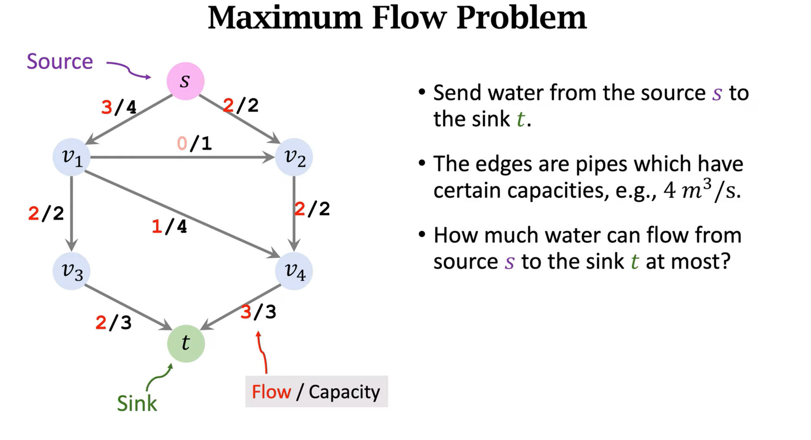

如何应用贝叶斯网络来做决策？

- 首先需要将先验知识表达成一个因果图--贝叶斯网络，（准确来说贝叶斯网络的边不仅仅表达因果关系，他表达所有的信息传播的方向）。
- 做推断

1. 构造贝叶斯网络

   
2. 推断

已知P(R,W,S,C）, 求P(r)

### 枚举法

1. 先推到条件概率分布

  

2. 

### 变量消除法

所有非query变量祖先的变量，都应该被消去，当然不是真的消去啦，是对该消去变量求和，然后变成一个新的因子f。

依次迭代，直到没有可以消除的变量。

### 贝叶斯网络中的依赖性

1. 每一个随机变量都是条件独立于他的非后代节点，给定他的父母节点时，
2. 如下，给定A，B时，C和D是独立的。

   
3. 每个随机变量独立其他任何变量，当给定他的马尔可夫毯（Markov Blanket）
    - 父亲，孩子，以及孩子的父母亲（配偶）
    

      

## 参考

1. [Bayesian Networks-youtuybe](https://www.youtube.com/watch?v=TuGDMj43ehw)