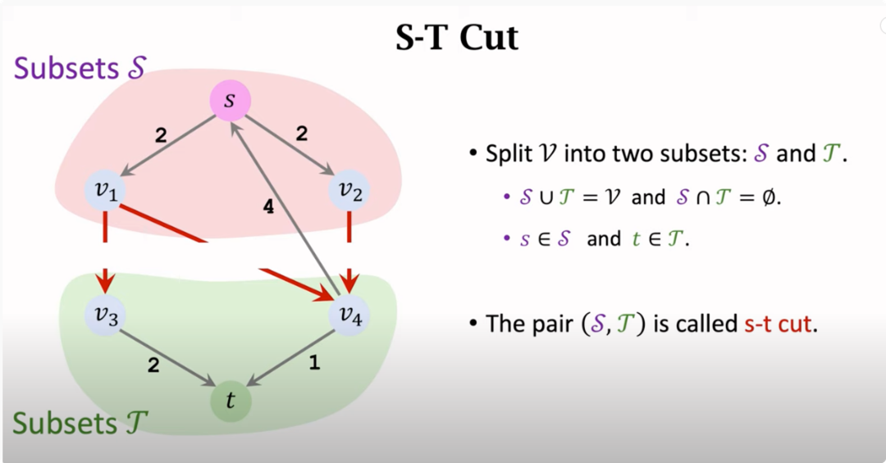
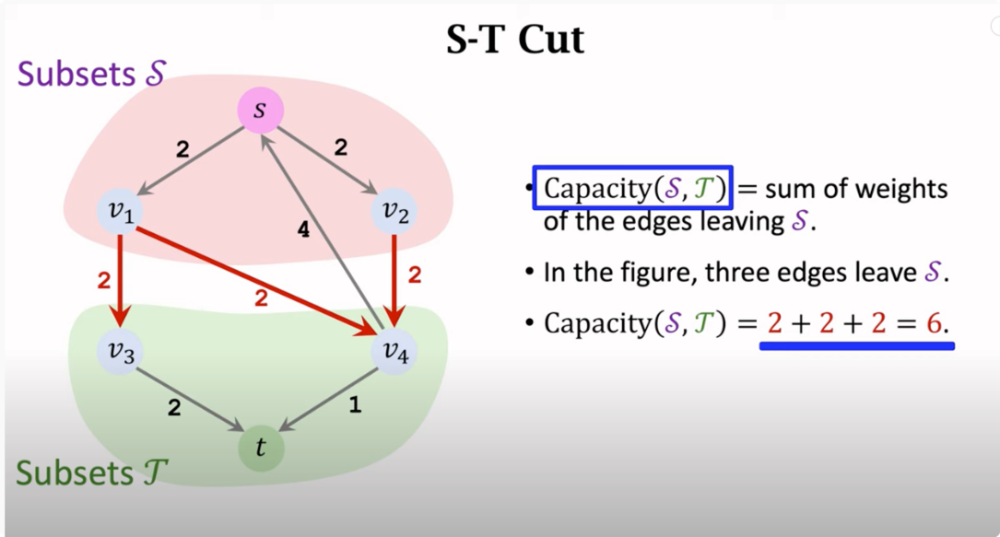

## 图的定义

传统的空间都是定义在欧几里得空间（Euclidean Space）的，在该空间定义的距离被称为欧式距离。
音频，图像，视频等都是定义在欧式空间下的欧几里得结构化数据，然而对于社交网络等数据，使用欧几里得空间进行定义并不合适，所以将这一类的数据所处的空间称为非欧几里得空间。

非欧空间下最有代表的结构就是图（Graph）结构，
每一个图都有对应的4个矩阵：incidence matrix,A/degree matrix/adjacency matrix/拉普拉斯矩阵（laplacian matrix， L）

incidence matrix:$A \ in R^{m *n}$, m 是边的个数，n是节点的个数
每一行代表一条边的起点和终点

### 邻接矩阵（Adjacency matrix）

邻接矩阵是一个NxN的矩阵，对于有权图，其值为权重或0，对于无权图，其值为0和1，该矩阵定义如下：
$$A \in R^{N \times N}, A_{i j}=\left\{\begin{array}{ll}a_{i j} \neq 0 & e_{i j} \in E \\ 0 & \text { othersize }\end{array}\right.$$

### 度矩阵（Degree matrix）

度矩阵D是一个对角矩阵，其定义为：

$$D \in R^{N \times N}, D_{i i}=\sum_{j} A_{i j}$$

### 邻域（Neighborhood）

邻域表示与某个顶点有连接的点集，其定义为：$$N\left(v_{i}\right)=\left\{v_{j} \mid e_{i j} \in E\right\}$$

### 谱（Spectral）

### 拉普拉斯矩阵（Lapalcian matrix）

####  谱分解(Spectral Factorization)

什么是spectrum？
矩阵的spectrum就是矩阵的特征根。
只有方阵才有谱概念，方阵作为线性算子，其所有特征值的集合称为方阵的谱。方阵的谱半径为其最大的特征值，谱分解就是特征分解。

谱分解(Spectral Factorization)又叫特征值分解，实际上就是对n维方阵做特征分解. 只有含有n个线性无关的特征向量的n维方阵才可以进行特征分解.

> spectral定理用公式表达：对于一个对称矩阵S，其特征根$\Lambda$都是实数, 特征向量都正交$Q$
> 
> > $$S = Q\LambdaQ^T$$

graph laplacian 矩阵：connection of 线性代数和图论

拉普拉斯矩阵（laplacian matrix），$L \ in R^{n *n}$
$$L = A^T A= D-B$$

degree matrix：$D \ in R^{n*n}$，代表了每个节点有多少degree
adjaceny matrix：$B \ in R^{n*n}$，代表了任意两个点是否有link

拉普拉斯矩阵是半正定矩阵,其特征根从小到达排序
1. 第一个特征根为0，$\lambda_1 = 0$, 即DIM(null space) = 1，对应的特种向量为常熟向量
2. 第二个特征根（最小的正的特征根）叫fiedler， 对应的特征向量叫fiedler vector

graph的laplacian矩阵和laplace方程（有限差分方法）的关系：

laplace方程也叫微分方程，其微分形式 跟一个网格图的laplacian矩阵（n*n）就是离散形式。

3. 实对称矩阵,有n个线性无关的特征向量;
2. 其特征向量可以进行正交单位化;
3. 所有的特征值非负;

$$L=U\left(\begin{array}{ccc}\lambda_{1} & & \\ & \ddots & \\ & & \lambda_{n}\end{array}\right) U^{-1}=U\left(\begin{array}{ccc}\lambda_{1} & & \\ & \ddots & \\ & & \lambda_{n}\end{array}\right) U^{T}$$

有时，使用的都是正规拉普拉斯矩阵（Symmetric Normalized Laplacian matrix）:
$$L^{s y s}=D^{-1 / 2} L D^{-1 / 2}=I-D^{-1 / 2} A D^{-1 / 2}$$

## 图的算法

###  S-T Cut 

 S-T Cut 就是把一个图切成了两个子图，S和T

S-T cut的容量，就是链接S,C的变（图中红色的边）的权重求和，

### 最小割

最小割（min -cut），就是容量最小的那个S-T cut

最小割是指去掉图中的一些边，在使得图从连通图变为不连通图，并且尽可能保证去除的边对应的权重很小。

最小割可能并不唯一

对于相似性图来说，最小割就是要去除一些很弱的相似性，把数据点从一个连通的大图切割成多个独立的连通小图。

## 参考

1. https://zhuanlan.zhihu.com/p/84271169