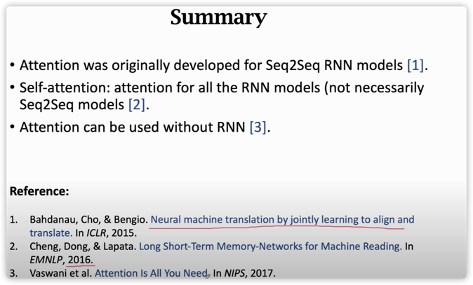
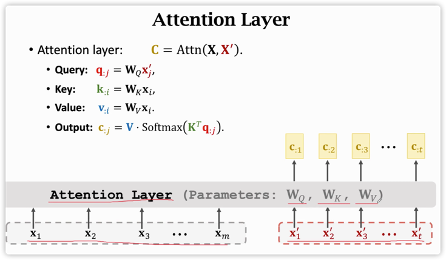

## attention
1. seq2seq有两个神经网络，一个encoder一个decoder。
1. 最早提出attention的设计是在2015年，bengio的一片机器翻译的文章，该文章中使用的seq2seq做机器翻译，创新之处在于对encoder的多个输出增加关注度，从而让decoder知道应该关注encoder的哪个地方的输出，
   从而解决了长输入序列遗忘的问题。缺点是计算量很大
2. Simple-RNN+attention层的工作机制：encoder结束工作之后，所有时刻的状态都要保留下来，需要计算decoder当前状态相对于encoder的状态中，每一个状态的相关性，得到一个长度为m的权重向量，每个元素都大于0，求和等于1。
3. 怎么计算decoder当前状态跟encoder状态间的相关性呢？第一种方法是原始论文的方法，定义成两种状态的非线性函数--含有trainnable参数，

4. 第二种方法是先定义两个矩阵k矩阵，和q矩阵，然后分别对decoder的状态和encoder的状态做先行变换，然后将先行变换之后的两个向量求内积，最后对权重向量做softmax归一化。这种方法使用更多，Transformer也是这个方法。
   
5. 计算好了长度为m的权重向量之后，然后作用于encoder的所有状态向量，于是得到了一个context vector。
6. decoder输入context vector和上一个时刻的状态，最新的观测值，输出下一个时刻的状态，中间的处理逻辑是怎样的？
   
7. 可以看到decoder输出的新的状态依赖于context vector向量，而context vector包含了输入的长序列中的信息，因此长输入序列遗忘的问题就可以避免了。
8. 值得注意的是，当decoder再次计算新的状态时，上一次算的权重向量和context vector就报废了，必须根据最新的状态和encoder的相关性刷新权重向量和context vector，这样也就是对输出的不同位置，给予输入不同位置不同的关注度。
9. 权重计算的时间复杂度是 mt,m为encoder长度，t为decoder长度。时间复杂度挺高的。
10. 英译法，当decoder想要更新state时，拿当前state跟encoder的额所有state对比了一下，发现短距离area对应的state最近，因此context vector非常接近area对应的state，因此输出的新的状态也会跟area更予以接近。
    
11. 总结一下，标准的seq2seq模型中，decode更新状态时，只看当前状态和最新的输入，这样产生的新状态可能已经忘记了encoder的部分输入。在seq2seq中加入attention之后，decoder每次更新state时，会先看一下decoder的所有状态。这样就知道encoder的完整信息，并不会遗忘。除了解决遗忘问题，attention还能告诉decoder应该更关注encoder的哪一个状态，这就是attention名字的由来。
12. attention可以提升seq2seq的准确率，但是要付出更多的计算。

## self-attention

1. 如何将attention剥离seq2seq，只用在一个rnn网络上，就叫self-attention
2. 提出self attetion的文章发表于2016年，把attention用在了lstm上面。
   
3. self-attention可以解决rnn的容易遗忘的问题，比如电影评论的情感分类，如果评论太长rnn的最后一个状态就很记不住整个语句，不能有效利用整句话的信息。
self-attention可以解决rnn容易遗忘的问题，每次更新状态之前都会看一下所有状态的重要性，这样就不会遗忘掉重要信息。下面这个图是
4. 下面的图中，红色的词表明当前输入，蓝色的阴影表明关注度得分。
   
   

## 参考
1. [RNN模型与NLP应用(8/9)：Attention (注意力机制)](https://www.youtube.com/watch?v=XhWdv7ghmQQ&t=183s)
2. [Long Short-Term Memory-Networks for Machine Reading](https://arxiv.org/abs/1601.06733)