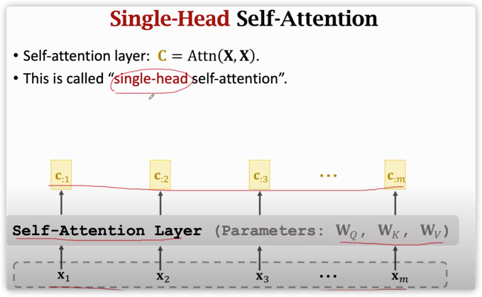
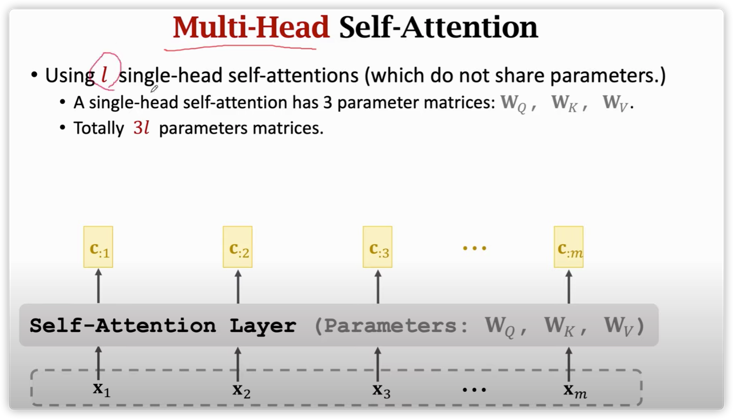
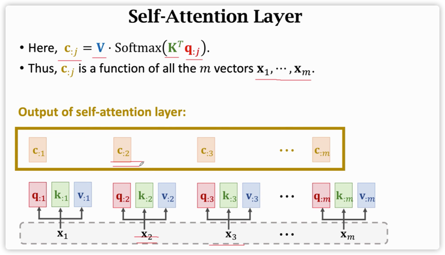
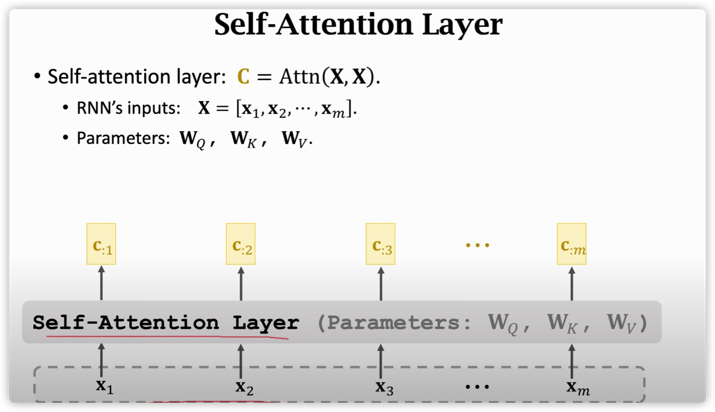
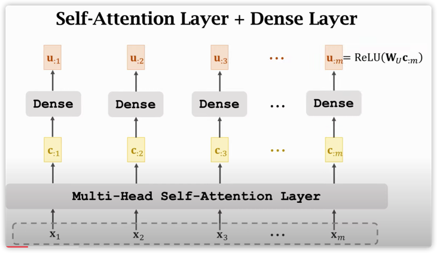
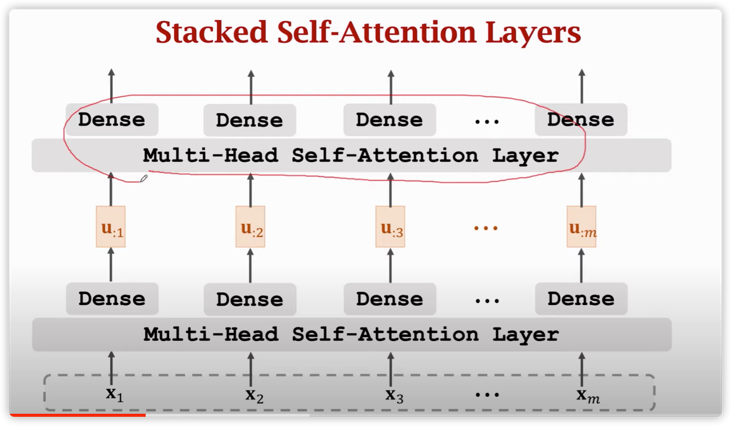
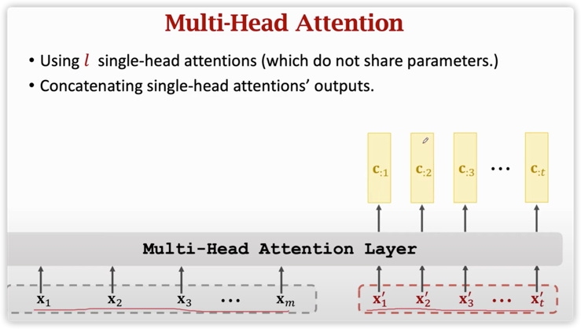
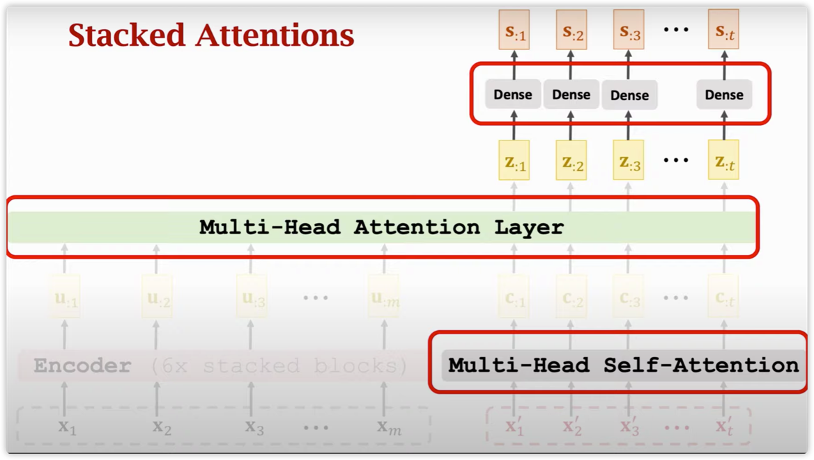
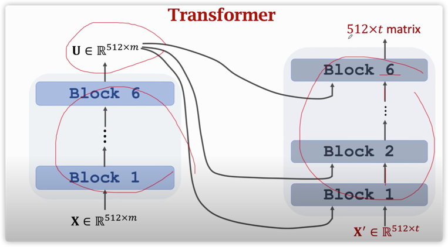
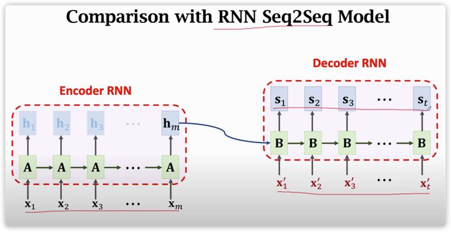

# Transformer总结

- Transformer是google2016年在《attention is all you need》提出的一个机器翻译模型，是一个很典型的seq2seq架构。
- Transformer的亮点在于将attention和self-attention完全剥离开之前rnn的结构，只跟dense层组合。
- Transformer跟RNN没有关系, 只有attention和全连接层
- Transformer比所有的rnn+attention效果都要好，机器翻译的王者
- Transformer是一个翻译模型，在机器翻译任务中，eg德译英，输入一个德文句子，输出十一句英文。
- Transformer由两部分组成：encoders和decoders
- encoders由6个encoder堆叠而成，decoders由6个decoder堆叠而成，一个encoder或一个decoder叫做一个block。
- encoders的每个block有2层：self-attention和dense，每个block结构相同，但不共享权重。
- decoders的每个block有3层：self-attention，attention和dense，其中attenton用来关注encoder的输出，
- attention技术的演进：attention + 基于rnn的seq2seq --> self-attention + lstm --> attention/self attention + dense.
- 论文通过增加"多头"注意机制强化self-attention layer。 这在两个方面改善了self-attention层的表现:它扩展了模型关注不同位置的能力。单头机制虽然会注意到其他单词，但是注意力还是 很有可能完全被当前自己的状态牵制。多头的话，相当于多审视几遍 这个注意力，减少完全 关注自己 情况发生的可能性。 它给予attention层多个"表示子空间"。 正如我们接下来将看到的，通过多头，我们不仅有一组，而且有多组 query / key / value 权重矩阵(Transformer 使用八个头，因此我们最终为每个encoders / decoders设置了八组)。 这些集合中的每一个都是随机初始化的。训练完后，每组的三个矩阵，用于将embedding输入映射到表征子空间。

# 附录

## 输入和位置编码

1. 和一般的NLP任务一样，用embedding algorithm将每个输入单词转化为词向量之后，才能作为Transformer的输入使用。
2. 如下图，3个单词被embedded为3个512维的向量
 
3. 接下来，将这3个512维的词向量传入self-attention和dense层

4. 位置编码（Positional Encoding）表示序列的顺序, 为了让模型学习到词的顺序关系，transformer向每个输入embedding向量（x1）又加上一个位置编码向量（t1）。

5. 假设embedding的维度是4，那么实际的位置编码看起来是这样的:

## 多头self attention

1. 每个单头self-attention层有三个参数矩阵，单头的context vector是一个d * m维的矩阵

2. 多头attention层就有3*l个参数矩阵（l代表头的个数），多头的context vector是一个(dl) *m维的矩阵

   
3. 类似上面提到的单头self-attention计算，我们现在只是用8个不同的权重矩阵算了8次，并且得到了8个不同的 z 矩阵

3. 当解读一个句子中的一个word时， Transforme中的encoder通过self-attention来回顾上下文信息，找出输入序列中的重要的word，从而更关注重要信息，并且会把重要word的value vector编码到自己的向量里面去。
RNN通过hidden state策略，使得它将当前词与上下文（准确来说只有上文）的信息进行融合。
4. self-attention的输入是m个词向量，输出是m个context vector，vector表示融合了上下文之后，对word再次编码。

5. 如何实现self-attention layer？即如何实现计算context vector？
- step1: 对于每个输入的word的此向量分别计算3个表示向量：
  - Query vector： $q_i$, to match others；
  - Key vector：$k_i$, to be matched；
  - Value vector：$v_i$ to be weighted averaged 。
  - 这些向量是通过将输入的词向量做三次线性变换得到的，当然对应的三个矩阵是需要学习的。
  - 请注意，得到的新向量的维度（64）比embedding（512）小。这么设计为了保证，加入多头self-attention之后，encoder的输出和输入维度（512）还能保持一致。
   > 8头 * 64 = 512
- step2: 计算权重分数, 目的是量化其他单词应该被关注的程度。
   - 计算当前单词的query vector和其他单词的key vector的内积
- step3: 权重分数归一化。将上一步算出来的权重得分向量（长度为m）进行归一化，目的是让权重不要受到key vector的长度（paper里面是64）的影响，这样算梯度就更稳定。
- step4：将归一化的权重得分向量（长度为m）送入softmax，目的是得到一个概率向量，所有数值加起来为1。示每个单词应该被当前单词关注的程度，值越大越应该被关注。。
- step5：计算contect vector。将每个单词的value vector使用权重概率向量进行加权求和，作为当前单词的self-attention表达（输出长度为64 * 8个头 = 512）。
6. 把刚刚的过程再加入一个维度，也就是从一个单词 变成 多个单词，计算他们各自的self-attention表示，用矩阵表达该计算流程：
- 第一步是计算 Query、 Key 和 Value 矩阵：
   - 我们将embeddings塞到一个矩阵x：行数表示单词个数，列表示embedding的长度
   - 权重矩阵(WQ、 WK、 WV）：行代表embedding向量的长度，列分别代表query空间，key空间，value空间的维度
   - X分别和这几个矩阵相乘
   
- 第二步，利用第一步的结果来计算attention的输出，用一个矩阵计算来表达，简洁优雅
    

## dense层

1. 后面怎么跟dense层进行衔接呢？1. 将这8个z矩阵进行列拼接（concat）；2. 拼接后的矩阵大小为m*(8*64) = m *512，丢入dense层

2. 这就是multi-headed self-attention的大部分内容。把整个过程放在一个图中描述：

   

## encoder block = 多头self-attention + dense layer
1. encoder block ≈ 多头self-attention + dense。encoder block的输入维度是512×𝑚，输出维度是512×𝑚.
2. 以一个短句为例,看看encoder的处理流程:
   1. 将[x1，...,xm]输入多头self-attention层, 得到m个context vector
   2. 将m个context vector输入dense + relu，得到m个重新编码后的向量[u1,...,um]，dense层对m个word生效。
   3. 将[u1,...,um]传递给下一个编码器encoder2作为输入。
      
      

## 残差连接和layer-normalization

1. 每个encoder block中，self-attention和dense都有一个残差连接，然后接一个层标准化（layer-normalization）。

2. 如果我们将残差连接和layer normalization用矩阵表示，就是下图：

3. decoder的sub-layers 也同样用到了add & normalization的设计。
下图是一个简化版的Transformer架构：由2个stacked encoder和2个stacked decoder组成。

4. 更准确来说 encoder block = positional codeing + 多头self-attention + add & normalizatioin + dense layer + add & normalizatioin

## encoder network = 6 * encoder block 

encoder network is a stack of 6 encoder blocks.

## 多头attention

1. 单头attention层，要计算3个向量，先计算q跟每个k的相关性（求内积），然后做softmax变换得到权重得分，对所有的v使用该权重求和，得到decoder的这个词相对encoder的表示，也就是context vector。

2. decoder中的attention，q来自两部分：下面的decoder的输出和最上面encoder中的Keys矩阵和Values矩阵 。
   
   
1. Attention 层的Queries 

   

## decoder block = 多头self-attention +  多头attention +  dense layer

1. 1个decoder block ≈ 多头self-attention + 多头attention + dense。decoder block的输入有两个，一个是encoder的输出（512×m）， 一个来自decoder当前的的输出（512×t ）.
2. encoding阶段（phase）完成后，我们开始decoding阶段，decoding的每个step描述如下：
    
   
    1. 每个时刻，输入第6个encoder产生的m个keys vectors和value vectors，输出一个element的概率分布pdf。
    2. 从pdf中抽样出word（或者直接选择概率最大的word），作为decoder的输入。
    3. 重复step1，直到产生结束符。
3. decoder也会用到位置编码.
4. decoder中的self attention layers:与encoder的运作方式略有不同,在decoder中，self-attention layer只能接触到输出序列中的前半部分。怎么做到呢？在softmax操作之前，masking序列后半部分(设为 -inf)

## decoder network = 6 * decoder block 

1. Decoder network is a stack of 6 decoder blocks.

    
    
2. stack decoders输出一个数值向量。 我们怎么把它变成一个词呢？ 这是最后的dense层+softmax在做的事情。它将stack of decoders的输出映射为一个权重向量。（长度就是输出词汇表的大小）
3. 这个图从底部开始，生成一个vector作为decoder stack的输出。 然后它被转换成一个输出单词。
 

## Transformer = encoder network+ decoder network

## 训练

学习的目标？ 将模型输出与目标输出进行比较，然后使用反向传播方法调整模型的权重，使模型输出更接近目标输出。

如何比较两种概率分布？ 可查看 [cross-entropy](https://colah.github.io/posts/2015-09-Visual-Information/)和 [Kullback-Leibler](https://www.countbayesie.com/blog/2017/5/9/kullback-leibler-divergence-explained). 。

目标概率分布：

模型输出：

## 应用的一个例子

# 参考

1. Bahdanau, Cho, & Bengio. Neural machine translation by jointly learning to align and translate. In ICLR, 2015.
2. Cheng, Dong, & Lapata. Long Short-Term Memory-Networks for Machine Reading. In EMNLP, 2016.
3. Vaswani et al. Attention Is All You Need. In NIPS, 2017.
4. [Transformer模型(2/2): 从Attention层到Transformer网络](https://www.youtube.com/watch?v=aJRsr39F4dI)