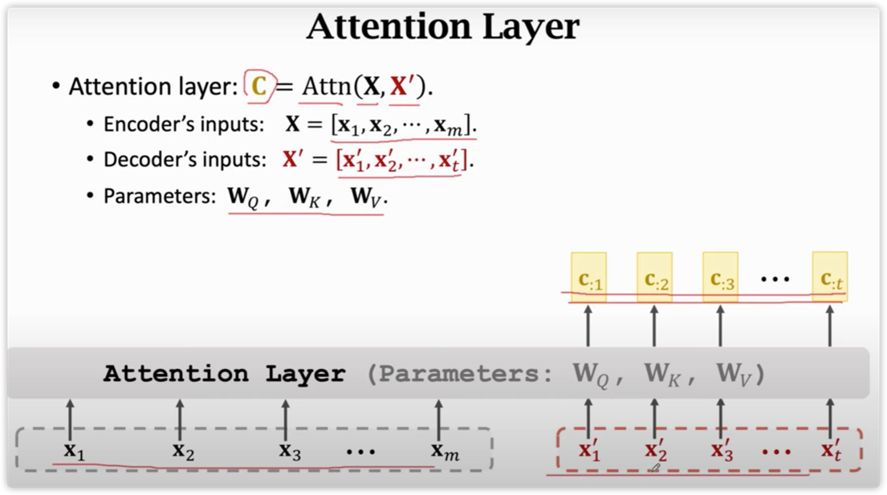

## 总结

- GPT的全称是generative pre-training，通用预训练模型，
- elmo有94m个参数，bert有340m个参数，GPT有1542m个参数
- GPT是transformer的decoder network
- GPT的学习任务是，给定一些word，预测接下来的word是什么？
- GPT神奇的地方：没有训练数据的情况下，可以做阅读理解（表现很好），生成摘要（一般般），翻译（一般般）。做到了zero-shot learning
- GPT3也是一个语言模型，有史以来最大的语言模型，有1750yi个参数，训练一个商用的GPT3模型，要花1200w美元

- bert模型是需要对特定任务搜集特定数据持续学习的。GPT野心更大，想做zero-shot，fine tuing都不要，见下图：
  
- 举个例子，

- GPT要解决三个任务：Few-shot Learning/One-shot Learning/Zero-shot Learning。
    
    > 注意，GPT的Few-shot Learning跟一般的Few-shot Learning不一样，GPT不会对模型去fining tuning ,bert是需要fine tuning的

- GPT使用的是in context learning，跟meta learning有一点点不一样
- GPT不擅长做NLU的问题，即逻辑判断的问题。

## GPT系列的架构图

## 参考
1. [GPT-youtube](https://www.youtube.com/watch?v=DOG1L9lvsDY)
2. [GPT-slide](http://speech.ee.ntu.edu.tw/~tlkagk/courses/DLHLP20/GPT3%20(v6).pdf)
3. [gpt-huggingface](https://huggingface.co/openai-gpt)
4. [gpt3-paper](https://arxiv.org/pdf/2005.14165.pdf)
5. [gpt2-paper](https://d4mucfpksywv.cloudfront.net/better-language-models/language-models.pdf)
6. [gpt1-paper](https://www.cs.ubc.ca/~amuham01/LING530/papers/radford2018improving.pdf)