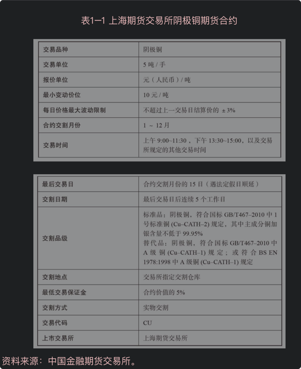

## 总结

1. 元宇宙（Metaverse）的Meta表示超越，verse表示宇宙（universe），合起来表示“超越宇宙”, 指在一个脱胎于现实且始终在线的平行世界中，人们能够以虚拟人物（avatar）的形式自由生活。
2. 元宇宙是一个始终在线的虚拟世界，无限的人可以同时参与其中，有完整的经济系统不间断地运行，可以跨越真实世界和数字世界。同时，任何基于数据信息的形象、内容、财富等都可以在元宇宙流通，很多人、很多公司都会创作内容、商店以及体验，让它更繁荣。
3. “元宇宙”是“虚拟世界”内和每一个参与主体发生交互的信息本身、交互形式、交互过程的总集合

## 元宇宙的基石

1. NFT 的出现将改变虚拟创作的商业模式，虚拟商品从服务变成交易实体。在传统模式 下，像游戏装备和游戏皮肤，其本质是一种服务而非资产，他们既不限量，生产成本也 趋于零。运营者通常将游戏物品作为服务内容销售给用户而非资产，创作平台也是如此， 用户使用他人的作品时需要支付指定的费用。NFT 的存在改变了传统虚拟商品交易模式， 用户创作者可以直接通过生产虚拟商品，交易虚拟商品，就如同在现实世界的生产一般。 NFT 可以脱离游戏平台，用户之间也可以自由交易相关 NFT 资产。
2. NFT 可以成为元宇宙权利的实体化，如同实体钥匙一般。程序能够通过识别 NFT 来确 认用户的权限，NFT 也能够成为了信息世界确权的令牌。这将实现虚拟世界权利的去中 心化转移，无需第三方登记机构就可以进行虚拟产权的交易。NFT 提供解决思路本质上 是提供了一种数据化的“钥匙”，可以方便地进行转移和行权，且一系列相应权限可以 存在于中心化服务或中心化数据库之外，大大增强了数据资产交易、流转的效率，且流 转过程完全不需要第三方参与。

## 元宇宙的发展阶段

从信息的角度，将元宇宙的发展分为几个阶段。

- Metaverse 0.1 版本：底层规则建立（1940s - 1970s）

在这个时期，电子计算机处于刚被创造出来的发展初期，人们设计了二进制的编码进行储存和计算，并在基础上拓展成“冯·诺伊曼原理”。同时，也设定了一套标准的“沟通机制”，用于以代码的方式去和计算机沟通。
也许当时的人们并没有意识到，正是这样的底层规则，不仅开启了虚拟世界的大门，也将两个完全不同的世界从代码输入的那一刻联系了起来。

- Metaverse 0.2 版本：信息基础传递（1980s - 1990s）

随着计算机技术的不断发展与更新，最初的电子数据交换也发展成了互联网，并逐渐开始其“连接”的使命。在这个过程中，我们从过去的“面对面”信息交流和沟通，变成了基于网络通信的“跨时空”双向信息传递。人们对于一个似乎能“连接万物”的新物种表现出了极高的好奇，几乎疯狂般地向互联网中发送信息，希望和虚拟世界中的一切建立联系。

不过，那时的网络通信技术有限制，无法像今天一样进行实时流媒体传输，“连接”的效率也有待提升。总的来看，这个阶段中人们对于互联网的态度，更多的是认为这是一个新的机遇，不断地向其中投入资本并产生各种信息数据，希望能借助于“互联网”这一物种产生经济回报，从而在真实世界中实现不同目标和追求。

- Metaverse 0.3 版本：信息高频交互（2000s - 至今）

当人们对互联网的使用日益增加，愈发地离不开基于互联网的应用，互联网本身也逐渐作为一种虚拟世界的基础设施存在于真实世界。通信技术的创新和进步也使得人们与虚拟世界发生交互的方式获得了提升，我们能够从虚拟世界中实时地获取高质量的各种流媒体，同时也开始向虚拟世界中贡献了爆发级别数量的信息。

由于虚拟世界的基础设施贡献，以及产生的各种内容，虚拟世界逐渐开始为真实世界提供价值反哺。在过去，虚拟世界创造价值的目的是为了让真实世界变得更好，但价值反哺意味着，真实世界产生的价值导向变成了让虚拟世界变得更好，也许是更加沉浸、更加自由、更加逼真或者更加与真实世界融合。

- Metaverse 未来版本：虚拟信息反哺（未来）

在未来，随着我们对虚拟世界建设的不断增加，虚拟世界的基础设置将会愈发的完善，并会逐渐地展现出更高的支持效率。其中，内容的丰富度和供给效率将会变得远超我们想象，并且会以实时计算、实时生成、实时体验、实时反馈的方式提供，从而让我们认为虚拟世界和真实世界无差别。

在这个阶段，虚拟世界的经济体系已经“连通”，经济系统也已完善，同时伴随着对应的管理和治理结构，因此我们可认为这个阶段属于“元宇宙”的形态。同时，虚拟世界对真实世界的反哺也到达一个前所未有的高度，人们在真实世界中产生的价值，将会被大规模地投入到虚拟世界中，并更多地在虚拟世界完成经济和社会意义上的循环与迭代。

“元宇宙”不会一夜之间出现，也不会是仅由一家公司打造和运行的，同时也许也不会有一个非常明确的节点或事件标志着正式的诞生和成熟。

## 市场上的先行者

1. 于2002年上线的《第二人生》（Second life）的游戏，已经非常接近Metaverse。因为它不是一个专注于“赢”的游戏，而是一个开放式的世界，主旨是探索、交流。
2. 2017年, 由Epic Games开发的大逃生类型游戏《堡垒之夜》在不断迭代之后，似乎开始显露出元宇宙的部分特质，逐渐成为了一个超越游戏的虚拟世界。截至2020年5月，《堡垒之夜》在全球已拥有3.5亿注册玩家。据统计，对于每周至少玩一次《堡垒之夜》的青少年用户来说，这个游戏占据了他们25%的休闲时间，并且逐渐成为结识他人的社交平台

    > 堡垒之夜是一款第三人称射击类游戏，融入 了沙盒游戏的玩法，因为玩法创新与各种联 动彩蛋而知名，具有很高的人气。

2. 2021年3月10日，「Roblox」在美国上市. Roblox是一个儿童版“元宇宙”。在Roblox中，玩家不仅可以参与游戏，还可以利用Roblox Studio中的简单工具创作游戏，并从中获利。并且，游戏平台上使用的虚拟货币Robux是可以直接转换成现实货币的。
   
   > Roblox 是多人在线的游戏创作平台，玩家在创作游戏时具备极高的自由度，平台具备全 沉浸式体 面且与现实经济互通的经济系统。虚拟资产验和虚拟身份可以在游戏内容间互通，创作者可以在自己游戏中设计商业模式。Roblox的模式已经可以看出元宇宙的雏形。
   > 堡垒之夜和Roblox代表了元宇宙发展的两种路径。 
   > 前者通过核心玩法吸引用户，添加新元素与丰富联动；后者通过开放式平台和创作激励机制实现了玩家主导的去中心化世界。
3. 2021年3月11日，GreenPark Sports为NBA粉丝创建了一个可以在多人观看NBA球赛的虚拟场景，并获得虚拟奖品例如限量版球衣、鞋帽等。
4. 2021年3月12日，红杉资本向虚拟办公平台「Gather」投资数百万美元，这平台可以支持虚拟婚礼、虚拟办公等多种场景。
5. 2020年4月，美国歌手Travis Scott在其中举办虚拟演唱会，有超过1200万观众观看互动。
5. 2021年4月7日「原神」云游戏服务商蔚领时代获1.5亿融资，小米领投，米哈游、中手游参与。
6. 2021年4月12日，显卡大厂英伟达（NVIDIA）CEO黄仁勋宣布将布局元宇宙业务
6. 2021年4月13日，字节入局元宇宙赛道，投资中国版Roblox-有爱互娱。
8. 2021年4月13日，美国游戏公司Epic Games宣布获得10亿美元融资，并将用于元宇宙业务开发.
9. Decentraland 是一款区块链游戏，游戏中的 沉浸式体 资产、土地是由 NFT 的形式存在，可以自由 验 的流转、交易，进行金融操作。区块链游戏 在经济系统上更为接近元宇宙的形式。
10. 《我的世界》是一款开放式沙盒游戏，极高的创 沉浸式体 作自由度为游戏带来了长久的活力。该游戏 验 在开放自由创作方向接近元宇宙，用户创作 为游戏带来了极为丰富的内容。
11. 魔兽世界是一款大型网络游戏，一段时间曾 经是现象级网游。游戏具备很强的沉浸感。 玩家可带入其中探索艾泽拉斯，也可以与公 会一同刷副本，在虚拟身份代入感、社交性 和体验感都靠近元宇宙概念。
12. [苹果将于2022年第二季度发布首款AR设备](https://www.36kr.com/p/1259437364588295)

## 看好Metaverse的声音

1. VR技术能带来很大的想象空间。Facebook Quest2 推出受到市场广泛好评。Oculus 系列是 VR 领域最重要的产品之一， 与第一代 Oculus Quest 相比，Quest2 更轻更薄，售价为 299 美元起，比上一代便宜了 100 美元，高性价比的产品也收到了市场的欢迎。扎克·伯格认为当 VR 的活跃用户达到 1000 万时，VR 生态才能获得足够的收益。随着各家新 VR 硬件的推出，VR 的市场风口 又在悄然兴起。
2. 元宇宙已经有了商业化的可能性。游戏、视频、直播，以及相融合的商业业态都让用户端有机会直接获取规模收入
    
3. 虚拟世界正在占据着用户越来越多的时间,比如Roblox的用户使用时长从2019年的137亿小时增长124％至2020的306亿；每日付费用户从2019年的约18.4万增长至2020年的约49.0万。值得注意的是，目前Roblox超过一半用户年龄小于12岁，同时呈现极高的用户粘性。

## 反对Metaverse的声音

1. VR发展不成熟
2. 没有内容生态
3. UGC游戏平台的竞争风险
4. 区块链的政策风险

## 参考
1. [为什么元宇宙Metaverse这两天又不火了？-2021-03-17](https://www.huxiu.com/article/415676.html)
2. [海外分析师：Metaverse将颠覆人类社交方式！](http://www.gamelook.com.cn/2021/03/416439)
3. [机器学习、虚拟世界与元宇宙 Metaverse](https://www.gcores.com/articles/129199)
4. 游戏葡萄、竞核
5. https://www.36kr.com/p/1251037741903617
6. 腾讯研究院-Metaverse: 互联网的未来是虚拟时空
1. [游戏里悼念袁隆平的B站UP主们](https://mp.weixin.qq.com/s/-txvtNWUfrXdGE8W_IeHZg)

