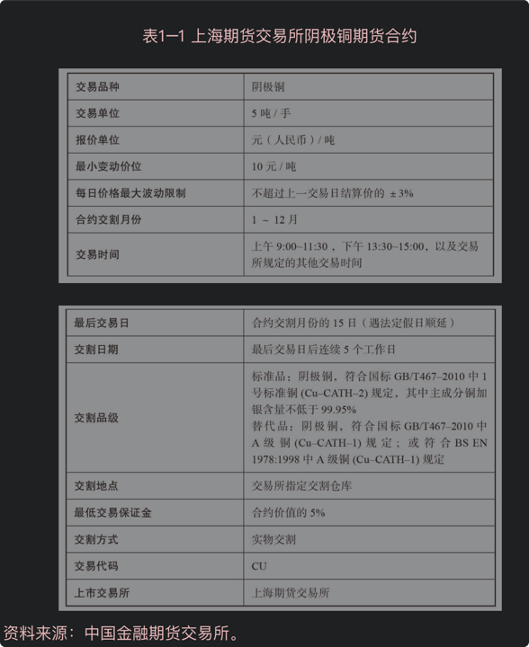

> 看这本书，一是因为工作相关，而是想考察下资本市场上，如何对SaaS工资进行估值

# 目标市场
1. SaaS产品的目标市场，即给SaaS产品付费的企业，也就是金主。从营收占比分布来看，是橄榄形的，中间多，两头烧。
   特别有钱的企业和特别穷的企业，他们在营收中占比都很小，中间规模的企业贡献了主要的营收占比。
   有钱的企业，虽然客单价高，但是客户就那么几家。
   中等规模的企业（50人到500人），占据着50%以上的市场份额。
   小微企业（50人以下），给不起钱。
2. 对于小微企业，一套SaaS系统每年5000～10000元，他们也会嫌贵。他们更愿意用免费的企业微信、邮箱、钉钉来做团队内部的沟通。（企业微信为什么要做免费版？）
   从供给和需求的角度分析，小微企业需求度并不高，免费的软件也用的很香。saas开发商，开发成本很大，投入的人力多，成交周期长。
   
   并且，大部分小微企业活不久，所以续费率低。（注意saas的收费模式--续费制）
   2013年-2017年，国内有很多saas公司都尝试过进入小微企业市场，但是失败了。
   具体来说，要不要进入某个市场，还涉及到计算营销投入产出比。
3. 中部市场，有大量的中小企业，是SaaS产品的优质目标市场。该类市场有这样几个特点。
   - 大量客户：几万家到几十万家。如果一家愿意付费500万，就是500亿到5000亿的市场，如果占据了50%的市场份额，就是250亿到2500亿的市场。
   - 由于外部竞争激烈，  企业有提高效率的刚性需求
   - 中部市场的企业由于在同一个市场上长期竞争，盈利模式和管理方式趋进相同，因此需求相对「标准」，标准产品就能满足70%以上的使用需求 
   - 这部分企业不愿意承担高额定制开发费用，更愿意接受标准产品。
   目标市场的这几个特点，产生的根本原因是："橄榄形"市场中部有大量中小企业处于竞争之中。
   
4. 头部市场：大部分行业而言，头部企业的人员和营收规模很大，业务流程管理也相对规范，但是这些企业是供应商竞相争夺的行业标杆，由于规模大，业务需求独特，同时也能承担高额的定制化开发费用，所以他们经常会挑选没能做定制化开发的IT供应商。
很多SaaS厂商发展前期肯为企业做定制化开发，是为未来打磨标准化产品做准备

SaaS公司的标准化产品能够不断从客户那里吸取养分，在形成客户满意度高的标准产品后，口碑和品牌效应也会降低获客成本，

## "哑铃型"市场

- “哑铃型”市场：头部企业数量不多，但占据了很大市场份额；后面还有大量长尾小微企业，也占据了一定市场份额；这样留给中间的中小企业的市场空间就不大了。
- 在国内，餐饮行业、教育行业、健身房门店，包括SaaS领域自身，都属于“橄榄型”市场；
- 而石化、银行、供电行业，是典型的“哑铃型”市场，客户企业更需要定制化开发系统

## 为什么中国saas公司会陷入激烈竞争

美国saas创业者不认可抢占既有的细分赛道，更原因在别人的创意旁边另辟蹊径。也就是说更喜欢差异化策略，但是中国的saas公司常常为陷入激烈的竞争，为什么呢？

- 热钱多，导致竞争过程中以"销售额"为导向，而不是以"利润"为导向。
很想现在的互联网公司，只看流量，不看月活
- 中国市场大，创业热度高，创业者水平参差不齐，容易做出激进决策，简单说就是非理性，不懂得合作共赢。
- 有一个不好的行业共识，"先用低价干掉对对手，未来再提价"。但是，在自由竞争的局面下，不存在长时间的垄断利润。比如滴滴合并快递，uber之后，看到打车市场有高毛利率，美团高的和首汽约车都来竞争，已经奄奄一息的老对手也能再融到钱和你竞争，新的玩家也会再出现。
    - 淘宝被京东赶超
    - 百度搜索被今日头条赶超
    - 微信被抖音赶超

   

# SaaS公司的商业模式

1. 市场定位与商业模式在初期就要想清楚，和验证清楚。 要知道市场的天花板在哪里。很多创业者以为未来市场很大，是因为从来没有当上过“行业第一”。
2. SaaS公司的几个商业模式：买断模式/收年费/消耗模式/分销售额/产业互联网。
3. 关于产业互联网：SaaS产品首先是工具，但是卖工具给别人后，别人用来挖出金矿跟我们没有关系。产业互联网的思路是，SaaS公司加入行业的业务层面，帮客户一起找金矿，然后和客户一起分享挖出来的金矿。
4. SaaS公司应该做IT工具还是参与产业互联网改造？产业互联网商业空间更大，但是不确定性不强，可能经历潮起潮落。当然也可能跌下去就起不来，比如老人手机。
5. 如果能把成熟的PaaS平台做出来，将来就可能像Salesforce一样吸引行业ISV（独立软件开发商）的关注，再通过平台战略占领企业级市场。

# 参考资料
1. [Iaas，Paas 和 Saas的区别](http://www.ruanyifeng.com/blog/2017/07/iaas-paas-saas.html)
2. [角逐PaaS：阿里 腾讯 用友们的阶级跨越之战
](https://www.ebrun.com/20190505/332506.shtml)