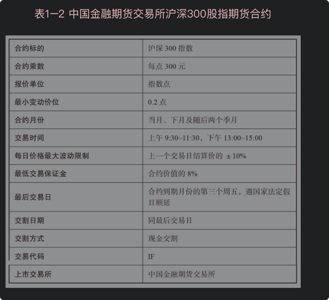

> 知乎以后能扭亏为盈吗？
> 
> 在国内，知识付费的商业模式行得通吗？最大的阻碍是什么？
> 
> 知乎是一个中国的在线问单社区，类似国外的quora
> 
> 知乎3月5号向美国证券交易委员会（SEC）递交了IPO（initial public offering），寻求在纽交所上市，股票代码为“ZH”，并确定由瑞信、高盛和摩根大通担任承销商。

---

下面是对知乎招股说明书的解读

## 知乎的财务数据和运营数据

FINANCIAL和OPERATING DATA

1. 财务情况总结下，近一年营收翻倍（从6亿人民币到13亿人民币），但是仍然是亏损状态（从10亿到5亿），

2. 知乎月活有7500w用户，其中付费用户300w。付费会员比例是3.4%

3. 营收构成，主要靠广告，其次是会员费，然后是基于内容的行业解决方案。2020年广告占比略微下降从86%下降到62%），

对于广告主来说，知乎的广告收入差不多每个用户可以卖12rmb。

4. 知乎的员工有1651名，研发人员有671名。

5. 知乎的CEO是李源，占股8.2%，拥有46.6%的投票权。

   

## 知乎的商业化
1. 商业化还是很困难的。知乎现在的风气像什么？一群乌合之众好为人师。建议是最廉价的东西，尤其对于不怎么要脸的人来说。站在知乎付费会员的角度，我交了钱让这些沙雕教我做人？这就很蠢。不过确实，如果知乎不提供小黄文这些功能，付费用户会觉得更加不值得。
2. 互联网中文社区的内容，99%都是垃圾，比例太大，如果放任自流，很有可能变成劣币驱逐良币的后果，戾气和攀比之风渐胜，恶劣的环境让本就稀少的高质量创作者的如履薄冰。
3. 这个平台缺的是，对劣质信息的惩罚措施, 还有风险共担的机制。

## 凤凰网的评论

1. 2011年，知乎上线，成为一代互联网人的精神家园。刚开始的知乎是“小而美”的,邀请制之下门槛极高(现在的clubhouse)，不仅有李开复、徐小平等大佬入驻，还有各垂直专业人士提供的专业见解，都为知乎贴上精英的标签。
2. 随着用户体量的增长，在保持“小而美”和扩大用户规模上，作为知乎创始人的周源选择了后者。2013年4月1日，知乎正式开放个人用户注册，不到一年时间，注册用户迅速由40万攀升至400万；2017年9月，知乎进一步开放机构号注册。
3. 创新工场创始合伙人汪华留言称,不断扩圈过程中，包括他在内的老用户也感受到社区氛围的稀释。但是这个大方向是没有问题的，如果只停留在少数高端用户的圈子，最后会变成某种闭门造车，反而不利于产生更好更多元的内容。正因为知乎破圈，才有了更多的角度和丰富的内容，才有可能有更高质量的内容，所以在这个大方向下要做的深耕细作，而这次融资也会使得知乎有更多的资源和能力来解决这个问题。
4. 周源认为，当社区发展超过一定规模以后，平台方能做的事情一定是有限的，不可能去想着要管理或者说去控制每一个细节。“如果某种行为违背了国家法律规定或知乎社区规范，那么我们会毫不犹豫的把它“干掉”。如果没有，我们认为也不应当因噎废食。”
5. 对于知乎的未来，周源认为知乎不是乌托邦，也不是理想国。随着用户量级的提升，知乎会更加趋近于线下真实社会的投射。

## 参考

1. [十年知乎IPO仍亏损：破圈争议与商业化难题凤凰网](https://tech.ifeng.com/c/84OLbxuTeir)
2. [知乎-招股说明书](https://www.sec.gov/Archives/edgar/data/1835724/000119312521070815/d72883df1.htm)