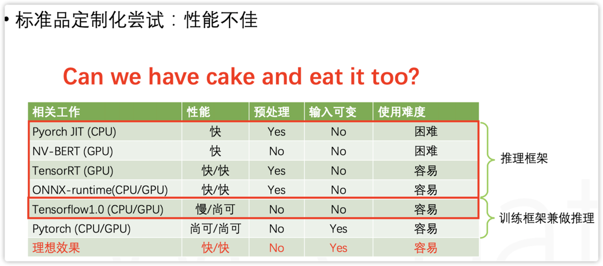

title: 模型推断的框架
author: chiechie
mathjax: true
date: 2021-04-18 08:53:17
tags:
- 深度学习框架
- 人工智能
- 模型部署
- AI工程
categories:
- 沉思录
---

> 解答了一直以来，关于模型部署的疑惑

## 关于模型部署

- 1 为什么说模型部署难？
    - 因为部署的环境不一样，所以需要许多定制化的工作
- 2. tensorflow和pytorch这两个框架不能直接用于推理吗？
    - 可以，但是性能不佳。推理阶段相对训练阶段对模型服务的性能要求更高，比如模型稳定性，响应延迟等，。
    - tensorflow和pytorch本身是训练框架，拿来兼做推理框架其实不可以。
    - 但是在推理阶段，如果业务要求模型服务 高可用，训练框架就显得过于臃肿了而不合时宜了，需要更轻量的框架，如pytorch，tensorRT等。
    
- 3. DL框架产业现状？
    - 训练框架是标准品
    - 推理框架是定制品：这里提到了一点就是使用场景没有**网络效应**，我理解就是规模效应，客观环境决定了，“推理框架”相对于“训练框架” 而言，不是一个好摘的果子
        - 客观环境（部署依赖整个生产链路的环境，包括硬件厂商，应用服务）导致了没有统一的条件

## 参考
1. file:///Users/stellazhao/Desktop/深度学习框架-2020-0630-Qlearning分享-Turbo-PPT.pdf
