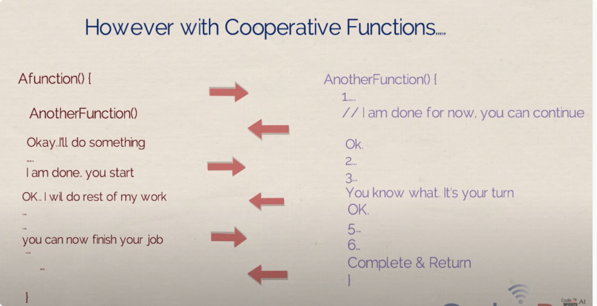

## 概览

1. 计算机上的存储单元的处理速度从快到慢依次是：

寄存器> L1>L2>L3>内存>固态硬盘> 机械硬盘

2. 早期的计算机只有寄存器和内存，但是寄存器的处理速度远高于内存，所以大部分时间是寄存器在等内存，所以CPU是处于空转状态。 经过改进
3. 除了寄存器，后面的计算机在CPU中又逐步加入了高速缓存--L1/L2/L3缓存，相当于让内存提前做功课，把数据提前取出来，在3个缓存中候着，等寄存器有空了就取来用。笨鸟先飞嘛。
4. L1/L2/L3缓存，每层速度递减、容量递增。L1缓存速度接近寄存器速度，大约1ns时延。
5. 多核CPU的L3对诶个core是共享的，L2和L1是每个core私有的。

6. CPU读取数据时，要从内存读取到L3，再读取到L2再读取到L1，同样写到内存时也会经过这些层次。

## 参考
1. https://www.junmajinlong.com/os/cpu_cache/
