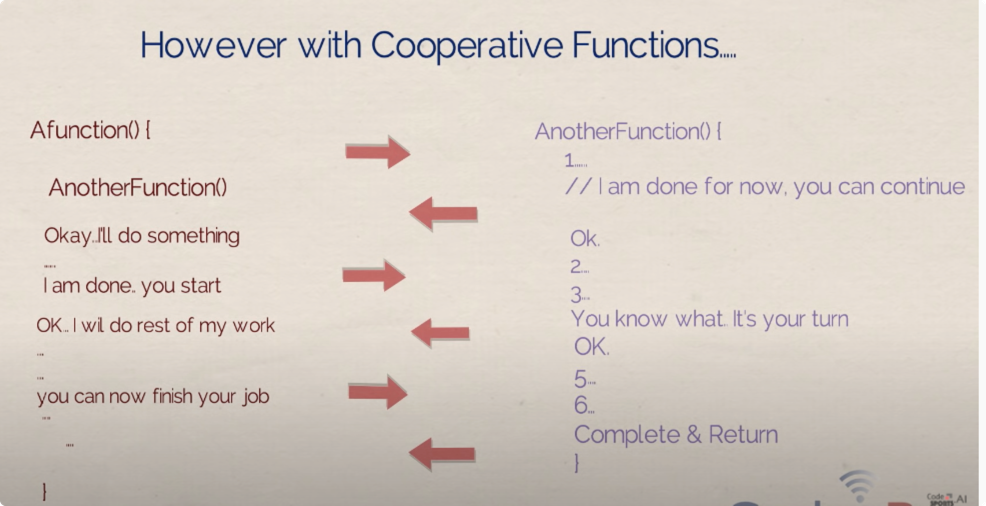

# 熵

## 信息

信息即information,衡量的是一个event发生了，带给我们的惊奇程度

I = -logP(x)

比如今天播报一条新闻，深圳7月下雪，那么我们说这个信息I很大，因为其跟常识偏差很大，可以用概率代表常识，跟常识偏离很远即概率很小。
比如今天新闻说，深圳7月下雨，那么这个信息I很小，因为根据常识也能知道会发生这个事情。

## 熵

熵即entropy,  衡量的是一个随机变量取不同的值的平均信息量，

$$Entropy = - \sum PlogP$$ 

均匀分布的随机变量， 其平均信息很小，熵很小，这是一个平庸的随机变量；

极端分布的随机变量，其平均信息很大，熵很大，这是一个不甘平庸的随机变量。

## 交叉熵

交叉熵表示，拥有信念Q的人，在观察到真实分布P后，他的惊讶程度。

这个绝对惊讶程度 可以拆解为 一个baseline（真实分布P的熵） + 一个相对差距（P和Q的距离）

## KL

KL（q||p）衡量的是分布p相对于分布q的距离，是一种非对称的local 距离。

## 参考

1. [交叉熵](https://d2l.ai/chapter_appendix-mathematics-for-deep-learning/information-theory.html#cross-entropy)
2. https://www.youtube.com/watch?v=ErfnhcEV1O8&list=WL&index=17&t=85s