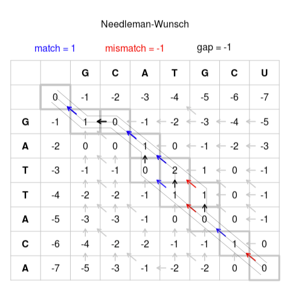

> 正则表达式一直都迷糊的很，现在要做日志聚类了，看看吧


## re.compile 和 split


re.compile: 将字符串的正则表达式，转换为pattern对象。

pattern对象，有点像re的中间数据对象，它有很多方法，like

- Object.split

```
>>> some_text = 'a,b,,,,c d'
>>> reObj = re.compile('[, ]+')
>>> reObj.split(some_text)
['a', 'b', 'c', 'd']
```

也可以不用先转换为pattern对象

```
>>> import re
>>> some_text = 'a,b,,,,c d'
>>> re.split('[, ]+',some_text)
['a', 'b', 'c', 'd']
```


## re.sub

re.sub：将某些固定的模式，替换为指定的格式。 比如 将连续空格转换为"-"


```
>>> import re
>>> some_text = 'a,  b,,,  ,c    d'
>>> re.sub(r'\s+', "-", some_text)
a,-b,,,-,c-d
```


## str.strip

去除首字符 和 尾字符


## 参考
1. [怎么写正则表达式](https://www.programiz.com/python-programming/regex)