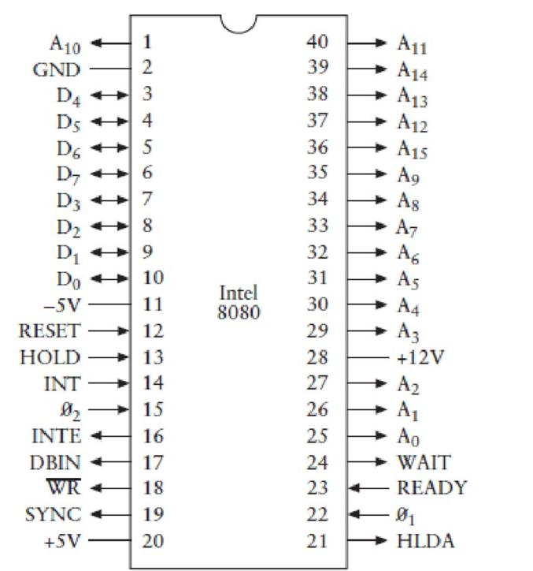
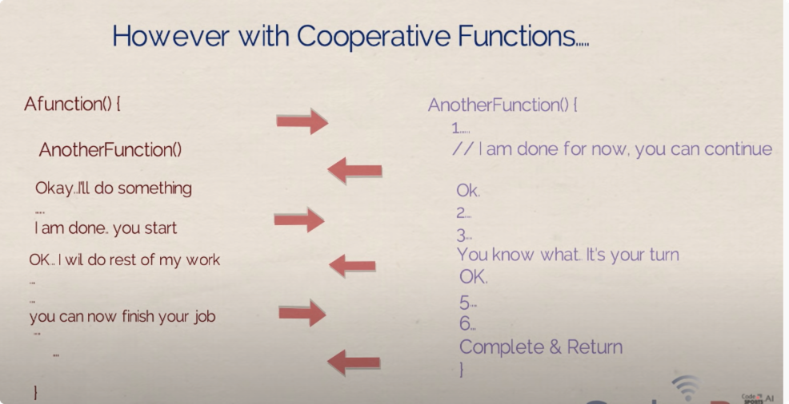

> 看这种高屋建瓴的文章，了解ai现状和未来--深度学习的局限，未来可能的发展方向
>
> 这种预测科技趋势的文章，只能领域专家，咨询公司基本都是扯淡（对，说的就是gartner）

## 现状-正视现实 vs 未来

1. 人工智能的6大领域：计算机视觉、自然语言理解、认知科学、机器学习、机器人学, 博弈和伦理。
   
2. 人工智能当前算不能算一门science，只是一个工程实践。
3. 人脸识别只是计算机视觉的一个很小的领域；深度学习是机器学习这个学科下的一个当红学派
4. 人工智能研究，简单来说，就是要通过智能的机器，延伸和增强人类在改造自然治理社会的能力和效率，最终实现人与机器和谐共生共存的状态。
5. 智能机器跟传统工具的区别在于，前者有自主的感知，认知，决策。学习，执行和社会协作能力，符合人类情感伦理和道德观念。

## AI的历史

> 回顾人工智能过去65年的发展历史，经历了几起几落(boom and bust)
   

1. 从表面看，人工智能发展史可以分为3个阶段：
   1. 第一次兴起是1956-1974，以命题逻辑、谓词逻辑等知识表达、启发式搜 索算法为代表。
   2. 第二次兴起是1980～1989，一批吹牛的教授、研究人员登场了，做专家系统、知识工程、医疗诊断等，基本还是以符号为主的推理，离现实世界很远，80年代末有个短暂的神经网络的研究热潮。随后，人工智能就跌入了近30年的寒冬。
   3. 第三次兴起时2012年到现在，是由深度学习推动的。有了以前的教训，一开始学者们都很谨慎，出来警告说这次做的是特定任务，不是通用人工智能，大家不要炒作。但是拦不住公司要做宣传，然后，大家开始加码宣传。就像踩踏事件， 处在前面的人是清醒的，他们叫停，可是后面大量闻信赶来的人不知情，拼命往里面挤。
   

2. 从更深层的理论看，人工智能的发展史可以分为2个阶段
   1. 前30年以数理逻辑的表达与推理为主。
   2. 后30年以概率统计的建模、学习和计算为主，这个时期，计算机视觉、自然语言理解、认知科学、机器学习、机器人学五大学科独立发展。在发展壮大的过程中，这些学科都发现了一个新模式，就是概率建模和随机计算。

> 现在，学科之间开始出现兼并状态。所以，我跟那些计算机视觉的研究生和年轻人说，你们不要单纯在视觉这里做， 你赶紧出去“抢地盘”，单独做视觉，已经没有多少新东西可做的了，性能调不过公司的人是一方面;更麻烦的是，别的领域的人打进来，把你的地盘给占了。这是必然发生的事情，现在正在发生的事情。
> 
> chiechie: 工业界不也一样吗？硬要在机器学习一个领域做，别人还结合业务做分析，结合专家经验，怎么拼得过人家呢？

下一章讲，用一个什么样的构架把这些领域和问题统一起来。

## 统一：人工智能研究的认知构架:小数据、大任务范式

1. 有了物理环境的因果链和智能生物的任务与价值链，一切都可推导。
2. 要构造一个智能系统，如机器人或者游戏中的虚拟的人物，我们先给他们定义好身体的基本行动的功能，再定一个模型的空间。其实，生物的基因也就给了每个智能体这两点.
3. 模型的空间通过价值函数、决策函数、感知、认知、任务计划等来表达。通俗来说，一个脑模型就是世界观、人生观、价值观的一个数学的表达。这个空间的复杂度决定了个体的智商和成就.
4. 是什么驱动了模型在空间中的运动，也就是学习的过程？外来的数据和内在的任务.
5. 内在的任务：有内在价值函数驱动的行为，以期望达到某种目的。
6. 机器人的脑袋和人的脑袋，都可以看成一个模型。任何一个模型都是由数据与任务来共同塑造的。
7. 当前的很多深度学习方法，属于一个"大数据，小任务范式"。针对某个特定的任务，如人脸识别和物体识别，设计一个简单的价值函数Loss function，用大量数据训练特定的模型。这种方法在某些问题上也很有效。但是，造成的结果是，这个模型不能泛化和解释。所谓泛化就是把模型用到其它任务，解释其实也是一种复杂的任务。这是必然的结果：你种的是瓜，怎么希望得豆呢？
8. 人工智能的发展，需要进入一个“小数据、大任务范式（small data for big tasks）”，要用大量任务、而不是大量数据来塑造智能系统和模型.
9. 人这个智能系统的习得包括3个阶段：
   - 亿万年的进化，被达尔文理论的一个客观的适者生存的pheontype landscape 驱动；
   - 千年的文化形成与传承；
   - 几十年个体的学习与适应。 
   
  而人工智能研究通常只考虑第三个阶段。

## 学科一： 计算视觉--从"深"到"暗"

cv领域被主流研究员忽略的几个重大问题：
   
1. 几何常识推理与三维场景构建：以前计算机视觉的研究，需要通过多张图 像(多视角)之间特征点的对应关系，去计算这些点在三维世界坐标系的位置(SfM、 SLAM)。其实人只需要一张图像就可以把三维几何估算出来。在我们的人造环境中，有很多几何常识和规律:比如， 你坐的椅子高度就是你小腿的长度约 16 英寸，桌子约 30 英寸，案台约 35 英寸， 门高约 80 英寸，这些都是按照人的身体尺寸和动作来设计的。另外，人造环境中有很 多重复的东西，比如几个窗户一样，大小一致，建筑设计和城市规划都有规则，这些就是 geometric common sense，你根据这些几何的约束就可以定位很多点的 三维位置，同时估计相机位置和光轴。见下图所示，在这个三维场景中，我们的理解就可以表达成为一个层次分解 (compositional)的时空因果的解译图(Spatial，Temporal and Causal Parse Graph),简称 STC-PG。
   
2. 场景识别的本质是功能推理：做场景的分类和分割都是用一 些图像特征，用大量的图片例子和手工标注的结果去训练神经网络模型，这是典 型的“鹦鹉”模式。一个场景定义本质上就是功能。STC-PG 解译图，每个场景底下其实就分解成为一些动作和功 能 (见 STC-PG 图中的绿色方片节点)。由计算机想象、推理的各种功能决定对场 景的分类。想象功能就是把人的各种姿态放到三维场景中去拟合(见厨房解译图中 人体线画)。这是完全不同于当前的深度学习方法用的分类方法。
3. 物理稳定性与关系的推理：我们的生活空间除了满足人类的各种需求(功 能、任务)之外， 另一个基本约束就是物理。我们对图像的解释和理解被表达成为 一个解译图，这个解译图必须满足物理规律，否则就是错误的。
   
   > 物理关系是需要建模的，类似因果图。
4. 意向、注意和预测: 厨房那张图有一个人和一只狗，我们可以进一步识别 其动作、眼睛注视的地方，由此推导其动机和意向
5. 任务驱动的因果推理与学习:
   1. 我们的知识是根据我们的任务来组织的。那么什么叫做任务呢？如何表达成数学描述呢？每个任务其实是在改变场景中的某些物体的状态.人类和动物忙忙碌碌，都是在改变各种流态，以提高我们的价值函数（利益）。要理解理解图像中的三维场景和人的动作，这就是因果关系的推理。因果就是:人的动作导致了某种流态的改。如何发现因果呢？这依赖图像之外的东西--“暗物质”(Dark Matter)。物理学家认为我们可观察的物质和能量只是占宇宙总体的5%，剩下的95%是观察不到的暗物质和暗能量。视觉与此十分相似：感知的图像往往只占5%, 而后面的95%，包括功能、物理、因果、动机等等是要靠人的想象和推理过程来完成的。
   2. 学习的本质不是会解题，“学而不思则罔，思而不学则殆”的思，应该是推理。对社会现象，行为和任务，形成一个符合规律的自洽的解释。也就是一个自己构建一个客观世界的因果模型，以及自己决策链。
   3. 推理计算的过程中，大量的运算属于“top-down”自顶向下的计算过程。也就是用脑皮层里面学习到的大量的知识来解释你看到的“蛛丝马迹”，形成一个合理的解释。

6. 计算机视觉历史

   

   1. 前面25年的主流是做集合，以形状和物体为中心（Geometry-Based and Object-Centered），
   2. 最近 25 年是从图像视角通过提取丰富的图像特征 描述物体的外观来做识别、分类: Appearance-Based and View-Centered
7. 计算机视觉要继续发展，必须发掘“dark matter”。把图像中想象的95%的暗物质与图像中可见的5%的蛛丝马迹，结合起来思考，才能到达真正的理解。现在大家都喜欢在自己工作前面加一个 Deep，以为这样就算深刻了，但其实还是非常肤浅的。不管你多深，不管你卷积神经网络多少层，它只是处理可见的图像表观特征、语音特征，没有跳出那5%。
   
   > 跟认知科学和自然语言接轨。
   

## 学科二： 认知推理--走进内心世界

1. 一般一岁多的小孩能知道给你开门，小孩很乐意、主动去帮忙。小孩很早就知道跟人进行配合，这就是人机交互。你把这个小孩看成一个机器人的话，你要设计一个机器人，就是希望它知道看你想干什么，这是人工智能的一个核心表现
2. 如果要做人机交互，首先要站在计算机的视角，去观察人的行为和内心世界，下面是一种尝试，用一个 STC-AOG 和 STC-PG 来表达的，见下 图，大致包含四部分：

   
   
   - 时空因果的概率图，即这个人的总知识
   - 当前的situation
   - 意向和动作规划，预判他接下来还会做什么
   - 当前的注意力，描述他正在关注什么？
3. 整个解译图放一块，代表着过去现在未来的短暂时间内的状态。
  
   
   
4. 每个 mind 除了上面谈到的知识 STC-AOG 和状态 STC-PG，还包含了价值函 数，就是价值观，和决策函数。价值观驱动动作，然后根据感知、行动去改变世界， 这样因果就出来了
5. 上面只是一个简单的一阶推理。在复杂、对抗的环境中，人们不得不用多阶 的表达。当年司马懿和诸葛亮在祁山对峙时，诸葛亮比司马懿总是要多算一阶。所 谓兵不厌诈，就是有时候我故意把一个错误信息传给你。

那么如何达成共识呢?语言就是必要的形成共识的工具了。

## 学科三： 语言通讯--共同的认知基础

1. 语言产生的 基础是人要寻求合作。
2. 人比动物更高级，是因为脑袋里有很多通信的认知构架(就像多层网络通讯协议)在大脑皮层里面，没有这些认知构架就没法通信
3. 与代数拓扑的联系： 
   
   - 拓扑学就是说图象空间，是一个全集。我们的每个概念往往是它的一个子集。以图像为例，所有的图象是一个集合，一百万个象素就是一百万维空间，每张图像就是这百万维空间的一个点人脸是个概念，所有的人脸就是这一百万维空间的一个子集
   - 子集和子集存在关系，叫拓扑关系，对应计算机的"语法"。比如头和脖子在 肩膀上是合规的，这个空间结构就是语法。
   - 语法可以导出语言，语言就是符合语法的所有句子的集合。
   - STC-AOG 就是知识的总体表达，而我们看到的眼前每一个例子是由 STC- AOG 导出来的时空因果解译图 STC-PG。计算机视觉，语言，认知，机器人都用它，就是一个统一的表达。

## 学科四：博弈伦理:获取、共享人类的价值观

1. 机器人要跟人交流，就必须理解人的价值观。因为一个理性的人，他的行为和决策总是在追求自己的利益最大化。同时，也可以根据一个人的行为推测这个人的价值观是什么。
2. 在人工智能学科中，通常把价值观表达为效用函数Utility function，这个函数包含两个部分-收益（loss 或者 reward）和成本（cost）
3. 我们每做一件事获得的收益，是定义在流态（fluents）空间里面的，每次行动，通过改变某些fluents，从而在U定义的空间中向上走。U对流态F求微分，就得到一个场。
4. 所谓“人往高处走、水往低处流”说的是社会和物理的两个不同现象，本质完全一致。就是人和水都在按照各自的势能函数在运动。那么驱动人的势能函数是什 么呢?
5. 机器人下棋, 一个关键就是学习价值函数,就是每一个可能的棋局，它要有一个正确的价值判断。各种游戏和强化学习也比较火热。但这些研究都是在简单的符号空间里面玩。
6. 有了价值函数，在一个多人环境中，就有了竞争与合作，形成社会规范、伦理道德，会达成暂时的「准平衡态」
   
7. 归纳学习（Inductivelearning）和演绎学习（Deductivelearning）：
   
   - 归纳学习（Inductivelearning）：通过观察大量数据样本，得到一个时空因果的概率模型（STC-AOG，每个时空的动作是一个 STC-PG）。数据样本就是对某个时期、某个地域、某个人群达成的准平衡态的观察，也是千年文化的形成和传承。
   - 演绎学习 Deductivelearning：从价值函数和物理因果出发，直接推导出准平衡态，要求对研究的对象有深刻的、生成式的模型和理解。
8. 人的学习往往是两者的结合。年轻的时候，归纳学习用得多一些，演绎学习往 往是一种不成熟冲动，交点学费，但也可能发现了新天地。到了“五十而不惑”的时候，价值观成型了，价值观覆盖的空间也基本齐全了，那么基本上就用演绎学习。
   
## 学科五：机器人学--构建大任务平台

1. 机器人是一个大任务平台，它不仅要调度视觉识别，语言交流，认知推理，还要执行大量的行动去改变环境，其实就是在改变环境的流态。
2. 流态分为两类：物理流态度，社会流态。前者如刷漆、烧开水、拖地板、切菜。后者如边，吃、喝、 追逐、搀，是改变 自己内部生物状态、或者是与别人的关系。
3. 当机器人重建了三维场景后, 就带着功利和任务的眼光来看这个场景, 比如哪个地方可以站/坐/倒水。在机器人规划中， 会先构建Affordance Map，即这个场景可以给你提供什么?

4. 有了上面的单个基本任务的地图，机器人就可以做任务的规划，当然做的过程中还要考虑因果、场景中别人的反应。考虑的东西越多，它就越成熟，做事就得体、不莽莽撞撞。

## 学科六：机器学习--学习的极限和"停机问题"

1. 计算机视觉，自然语言理解，认知推理，博弈伦理，机器人，这五个学科都是具体的"问题领域"（domain），而机器学习，是研究"方法领域"（methods），研究如何去拟合，如何去得到那些知识。前面五个学科像五个钉子，机器学习就是锤子，研究的是如何把那些钉子捶进去。深度学习就像一把比较好用的锤子。五大领域里面的人也发明了很多锤子，只不过最近这几年深度学习这把锤子比较流行。
2. 停机问题：在什么条件下，学习过程会终止呢?当学习过程终止了，系统也就达到了极限。比如，有的 人早早就决定不学习了。
   
   > 问问我自己，当学习一门新领域的时候，什么时候就可以停止学习了？我似乎也给不出答案，就只是在盲目的学习
   
4. 当前的机器学习是怎么学习的？包含三步:

   1. 定义一个损失函数loss function 记作 u，代表一个小任务，比如人脸识别，对了就奖励1，错了就是-1。
   2. 你选择一个模型，比如一个10-层的神经网络，它带有几亿个参数 $\theta$， 需要通过数据来拟合。
   3. 你拿到大量数据，这里假设有人给你准备了标注的数据，然后就开始拟合 参数了。
   
4. 机器学习在学习的这个过程没有因果，没有机器人行动，是纯粹的、**被动**的统计学习。目前那些 做视觉识别和语音识别都是这一类。
5. 机器学习的 学习方式是一种狭义的学习，是一种题海战术，填鸭式的训练。真正的学习是一个交互的过程，学生可以问老师，老师问学生，共同思考，是一种平等交流。

6. 这个学习过程是建立在认知构架之上的，是一种广义的学习，也叫通讯学习（Communicative Learning）

7. 这个图里面是两个人 A 与 B 的交流，一个是老师，一个是学生，完全是对等的结构，体现了教与学是一个平等的互动过程。每个椭圆代表一个脑袋 mind，它包含 了三大块: 知识$\theta$、决策函数$\pi$、价值函数$\mu$。最底下的那个椭圆代表物理 世界，也就是“上帝”脑袋里面知道的东西。上面中间的那个椭圆代表双方达成的 共识。
8. 这个通讯学习的构架里面，就包含了大量的学习模式，包括以下七种学习模式 (每种学习模式其实对应与图中的某个或者几个箭头)，这里面还有很多模式可以 开发出来。
   
   1. 被动统计学习 passive statistical learning:上面刚刚谈到的、当前最流行的
学习模式，用大数据拟合模型;
   2. 主动学习 active learning:学生可以问老师主动要数据，这个在机器学习里面
也流行过;
   3. 算法教学 algorithmic teaching:老师主动跟踪学生的进展和能力，然后，设计例子来帮你学。这是成本比较高的、理想的优秀教师的教学方式;
   4. 演示学习 learning from demonstration:这是机器人学科里面常用的，就是手把手叫机器人做动作。一个变种是模仿学习 immitation learning;   
   5. 感知因果学习perceptual causality:这是我发明的一种，就是通过观察别人 行为的因果，而不需要去做实验验证，学习出来的因果模型，这在人类认知中十分普遍;
   6. 因果学习causal learning:通过动手实验，控制其它变量，而得到更可靠的因果模型，科学实验往往属于这一类;
   7. 强化学习reinforcement learning:就是去学习决策函数与价值函数的一种方法

9. 我们学习谈话的构成，就是信息在两个椭圆之间流动的过程，影响流动的因素很多，列举4个：
   
   - 教与学的动机：老师要教一个知识，决策，价值，首先他要明确自己知道而学习不知道。同理，学生问老师，学生要明确自己不知道而老师知道。关键一点是，双方对自己和对方有准确的估计。
   - 教与学的方法：老师知道学生的进度，就可以准确提供新知识，而不是重复。
   - 智商问题：如何测量一个机器的智商，对很多动物，有些概念是教不会的
   - 价值函数：价值观不一致的人无法交流，更别说相互学习了。社会上也有这种分化的趋势。
10. 停机问题，就是说在多个人动态的学习过程中，所达到的平衡态。
   

## 智能科学--牛顿与达尔文的统一

> 古希腊伟大的唯物主义者坚持主张，一起物质事件都应当归结为一系列的有规律的原子运动，不允许把任何生物的意志作为独立的原因。笛卡尔无疑曾按他自己的方式重新探索过这一问题，但是在当时只是一个大胆的奢望，一个哲学学派问题的理想而已。在牛顿之前，没有实际结果来支持信念--认为物理因果关系有完整链条。 --爱因斯坦

1. 物理学依赖于一种基本的信念，物理世界存在这完整的因果链条，即自然界是统一的，牛顿力学则是证明这种信念的第一个成功范例。
2. 物理学的责任就是寻找支配自然各种现象的统一的力。这是一个信念，你相信这个东西，就不要唧唧歪歪，就为此努力！
2. 而对ai的研究，大家的看法还是肤浅和短视的，不追求统一的解释，只有一些工程法则。
3. 物理学把生物的意志排除在研究之外，智能科学则要研究物理和生物混合的复杂系统。
4. 智能科学比物理复杂的地方在于：
   - 物理学面对的是一个客观的世界，档当客观世界映射到人脑中，形成一个主观与客观融合的世界（贝叶斯学派），这个模型又被映射到别人的脑袋中，每个脑中包含上百个他人的模型的估计，这些模型来驱动人的运动和行为
   - 物理学可以把各种现象隔离出来研究，但是智能科学研究的是人和环境的交互的问题，本身就很复杂，很难隔离开。
5. ai要变成智能科学，本质上会是达尔文和牛顿理论的统一
    1. 智能物种与生俱来的任务与价值链条：这是生物进化的刚需，动物的行为都是被各种任务驱动的，任务由价值函数决定的，价值函数是进化论中的phenotype landscape。基因突变其实就是物种在这个进化的大时间尺度上的价值函数中的行动action。
    2. 物理环境客观的现实和因果链条：自然尺度下的物理世界与因果链条，即牛顿力学。
    

## 参考

1. [浅谈人工智能-朱松纯pdf](http://www.stat.ucla.edu/~sczhu/Blog_articles/%E6%B5%85%E8%B0%88%E4%BA%BA%E5%B7%A5%E6%99%BA%E8%83%BD.pdf)
2. [人工智能概要-脑图-腾讯文档](https://docs.qq.com/mind/DVGJoc1hqZkRrRmJw)