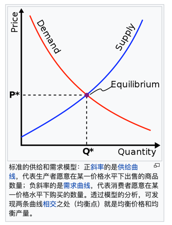

> 我为什么想学经济学？  想理解社会运行的逻辑?想了解一些现象背后的原因？政策背后的考量？ 想指导自己做决策，理性人怎么做？
> 现实生活中的一些问题
> 
> 1.比如开一家公司，要不要自己建食堂？
> 
> 2.公司的制度和治理，国家的制度和治理，如何制定？
> 
> 3.公司规模大是好还是坏？
> 
> 4.为什么要选经济学家做商学院的院长？商学院的教授在行业日进斗金，相对更经济学家的成本更高。

## 供给和需求哦行

## 经济学的三类问题

经济学的三类问题分别是：人们如何做决策，人们如何相互作用，整体经济如何运行。

人们如何做决策 和 相互作用 在西方 叫「微观经济学」，整体经济如何运行是宏观经济学。
「如何相互作用」在国内属于「宏观经济学』。
虽然涉及到一个产业，但还只是单个市场，不是整体。所以在西方还是叫微观。

### 个人如何做决策？
人们如何做决策? 关键词：权衡取舍（tradeoffs），成本（cost），边际（margin），激励（incentives）：

1. 人们面临得失交换，权衡取舍，所以经济学家适合做管理。
2. 某种东西的成本是为了得到它，放弃的东西。不是生产成本，而是放弃的其他东西带来的收益。
3. 理性人考虑边际量margin。margin就是收益函数的导数，细小的变化引起的变化。理性人做决策看收益函数的导数，而不是看收益函数本身。
4. 理性人对激励（incentives）做出反应即使。法律，政策 给人带来激励。
   > Capitalism is a powerful engine of economic growth because it rewards people for investing in assets that generate value over time, which is an effective *incentive* system for creating and distributing technological gains. But the price of progress in capitalism is inequality.

### 人跟人如何相互作用？
人跟人企业跟企业之间国家跟国家之间，如何相互作用？关键词贸易（trade），市场（ market）， 管制（ government）：

5. 贸易让每个人的现状更好？服务，货物，思想都可以被交换。
6. 市场通常是组织经济活动的一种很好的方法？market
7. 政府**有时**可改善市场的结果？governments 
   
### 经济作为一个整体如何运行？
经济作为一个整体如何运行 ？生产力（production）, 货币（money）, 通货膨胀（inflation） & 失业（unemployment）：

8. 一个国家的生活水平取决于他的**生产力**。
9. 当政府发行了过度的**货币**时，物价上升。
10. 社会面临**通胀**与**失业**之间的**短期**的权衡取舍。

## 举个🌰
1. 人们面临取舍：
   - 比如我的存款就这么多，需要在房屋大小和交通便利两个维度进行取舍。
   - 比如设计一款产品，设计和开发资源，需要在易用性和高效性上面做取舍。（人力够用，两个都要）
   要么先做核心功能，要么先做更基础的功能。
2. 某种东西的成本是，为了得到它而放弃的东西。工程学家视角：静态的，孤立的，eg生产升本。经济学视角：动态的，跟外界有关联的，eg机会成本
   - 比如，要评价一个项目的收益：工程师会说这个项目带来了**的营收的增加；经济学家会假设把这笔钱投资在其他项目，有没有可能挣得更多。
   - 比如，我现阶段买了一个房子，房子成本就是这段时间本可以在股市上赚取的收益；
   - 比如，我去看电影的成本，不是电影票的价格，而是我拿这一小时去学习，带来的收益。
   - 比如，我不跳槽，是因为换了一份工作，会失去现在的高额的收入。
3. 理性人考虑边际量：
   - 比如我要不要多吃一口？要不要多学一点？要不要多花一点时间？
4. 理性人会对激励做出反应。为什么金融危机中，大家都要疯了式的买衍生品？ 原因之一---衍生品本来是一种保险。有了保险，大家感觉就要像系了安全带，更大胆地开车--买产品，忽略风险。
5. 贸易让每个人的现状更好贸易-competition 和 specialization。可以让擅长的人做擅长的事情，但是，为什么现在是贫富分化更严重了呢。
6. 市场通常是组织经济活动的一种很好的方法。企业自己决定生产什么，计划经济是政府决定。市场看似混乱，实则有秩序。那么市场背后又谁在指挥？--"看不见的手"，即价格。
   这也是市场和企业的区别，企业内部没有价格机制，市场有价格价机制。
7. 政府**有时**可以改善市场的结果。市场失灵的时候政府的干预可以改进。市场失灵：影响外部；市场势力。政府可以做的事情比如控制垄断，发起一些基建项目，经融危机的介入，效率&公平。
8. 一个国家的生活水平取决于生产力。很好理解，创造的价值越多，得到的回报就越多，一个企业也是这样。但是生产力在全世界范围内，差异非常大。生产率--"人均一小时的产出"，之所以定义到小时而不是天，是因为要考虑到工作时长。美国人均GDP比法国高30%，但是法国人度假时间非常之多，每周工作时间很短，生产率法国更高，能更好地享受生活。
9. 当政府发行了过度的货币时，物价上升。物品数量有限，但是货币稀释了，所以每个物品卖出价格就上升了。
   - 猪肉价格上涨or房子价格上涨是不是通货膨胀？不是的，通货膨胀是指的整体的物价上涨。
   - 通货膨胀的主要原因是货币超发。猪肉涨价是这一个商品的需求供应有关系。
10. 社会通常面临 通货膨胀 和 失业之间的 短期的 权衡取舍。

因为货币发多了-->通货膨胀-->企业的原料涨价-->企业倒闭-->员工失业，这个逻辑链路么？
    

## 像经济学家一样思考
 - 经济学中，几个表达的方法：
     - 讲故事
     - 图表
     - 用数据推导
 - 生产要素是什么？生产需要的投入品，比如土地，劳动，资本
 - 循环流向图：一种图表示的模型，有假设
 - 生产可能性边界：

## 参考资料
1. [youtube-清华大学-经济学原理1--钱颖一](https://www.youtube.com/watch?v=UKB-hPWqtEc&list=PLgvxkXbWub7g9n3OLO_QdObcJ6UCy2ojS)
2. [youtube-清华大学-经济学原理2--钱颖一](https://www.youtube.com/watch?v=iyXyNyeBSIk&list=PLgvxkXbWub7g9n3OLO_QdObcJ6UCy2ojS&index=3)
3. [samaltman对现代社会的构想法](https://moores.samaltman.com/)
4. [bilibili-钱颖一](https://www.bilibili.com/video/BV1gt411g7RU?p=3&t=1411
)