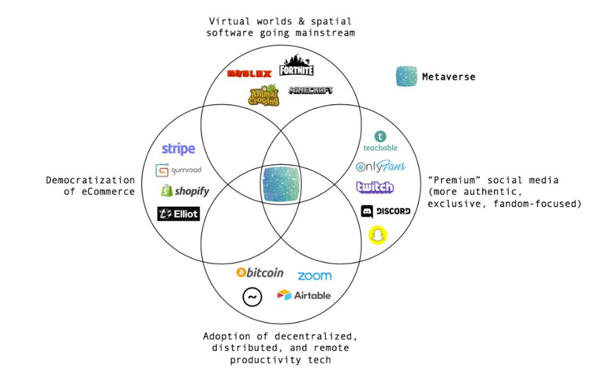

## 基础知识

1. 股票期权在上交所和深交所交易，上交所期权合约的交易时间为每个交易日9:30至11:30、13：00至15:00。9:15至9:25为开盘集合竞价时间，14:57-15:00为收盘集合竞价时间。
2. 交易期货可在四大期货交易所交易。
3. 自动行权指的是在期权合约到期时，一定程度实值的期权将自动被行权。券商应为投资者提供自动行权的服务。
4. 投资者认沽期权应当在证券账户中存放足额的合约标的，否则，期权经营机构有权拒绝行权。行权交割采取现金结算方式的，投资者应在向期权经营机构提交足额的资金。
5. 股票期权合约行权采取「实物交割」，即行权交收日通过合约账户对应的证券账户完成合约标的的行权交割，对于合约标的交割不足的，采取现金结算方式完成交割。
6. 合约单位是一张期权合约对应的标的资产数量.例如，一张股票认购期权的合约单位为1000，表示有权向期权卖方买入1000股股票。
7. 开仓是指投资者通过买入或卖出期权在市场上建立仓位。买入期权建立的仓位为权利仓（long position, 也称为长仓）。卖出期权的仓位为义务仓（short position,也称为短仓）。
8. 对已持有的期权仓位进行反向操作叫做平仓,平仓后投资者不再持有任何仓位。
9. 场外期权：在商业银行（还有证券公司，期货公司）的柜台交易，是一种非标准化合约。
10. 场内期权：标准化的合约，由交易所设计，在交易所内进行统一集中竞价交易，实行中央对手方清算（CCP）制度等。
11. 场内期权按照基础资产可分为：商品类和金融类：

  - 商品类期权包括：农产品，能源，贵金属，贱金属的，商品指数
    
  - 金融类期权包括：股票，股票指数，利率，外汇。
    
12. 上海期货交易所：成立于1990年11月26日，上市交易的有铜、铝、天然橡胶、燃料油、黄金、白银、锌、铅、螺纹钢、线材。
13. 大连商品交易所：成立于1993年2月28日，上市交易的有玉米、黄大豆1号、黄大豆2号、豆粕、豆油、棕榈油、鸡蛋、线型低密度聚乙烯、聚氯乙烯、焦炭和焦煤共计11个期货品种。
14. 郑州商品交易所：成立于1990年10月12日，交易的品种有强筋小麦、普通小麦、PTA、一号棉花、白糖、菜籽油、早籼稻、玻璃、菜籽、菜粕、甲醇等期货品种。
15. 中国金融期货交易所:于2006年9月8日在上海成立，交易品种：股指期货，国债期货。eg沪深300、上证50、中证500股指期货和5年期、10年期国债期货5个金融期货合约
16. 芝加哥商业交易所：利率期权，汇率期权，能源期权，农产品期权 
17. 芝加哥期权交易所（CBOE）：股票期权，股票指数期权，能源期权，ETF期权。
18. 商品交易顾问(Commodity Trading Advisor)，是期货行业的一种基金管理方式。
19. 交易型开放式指数基金(ETF)： 是一种在交易所上市交易的、基金份额可变的一种开放式基金。
20. 股票期权合约： 上交所统一制定的、规定买方有权在将来特定时间以特定价格买入（或者卖出）约定股票（或者跟踪股票指数的ETF等标的物）的标准化合约。例如50ETF期权： 以上证50为标的物的期权合约。
21. 股指期货： IF、IH、IC是股指期货的代码
    - IF：Index Future，标的物是沪深300指数， 例如IF1507表示2015年7月交割的沪深300股指期货合约。
    - IH：H表示“沪”，标的物是上证50，例如IH1507表示2015年7月交割的上证50股指期货合约。
    - IC：C是China，标的物是中证500，例如IC1507表示2015年7月交割的中证500股指期货合约。
22. 中国波动率指数（简称iVIX指数）：是由上海证券交易所发布，用于衡量上证50ETF未来30日的波动预期。该指数是根据方差互换原理，结合50ETF期权的实际运作特点，并通过上海证券交易所交易的50ETF期权价格的计算编制而成。iVIX指数通过反推当前在交易的期权价格中蕴含的隐含波动率，反映出未来30日标的50ETF价格的波动水平。
23. 期货与远期/互换的区别：前者是场内，后者是场外。场内更透明，标准化，流动性高；场外更定制化，流动性低。
24. 成交量指标:一般来说，资金流入流出的多少、成交量的大小，不是资产价格的领先指标，而是一个同步、甚至是滞后指标。 但是，对于一些高质量的资金流入，是需要重点关注的。比如一家上市公司的大股东，以大笔现金增持该公司的股票，是利好。
25. 滑点（slippage): 滑点跟成交价格一起作为交易指令发出，当场价格在成交价格+/-滑点这个范围内，都可以成交。

## 参考
4. [股票期货合约](https://www.htsc.com.cn/browser/view/gpqq.jsp#tit2)
1. [重视成交量指标-雪球](https://xueqiu.com/1340904670/172198829)
2. [对滑点和spread的解释](https://blackwellglobal.com/max-spread-slippage-mean/)
3. [发现价格-期货和金融衍生品-微信读书](https://weread.qq.com/web/reader/59d32f0071645a1359d4060kd3d322001ad3d9446802347)