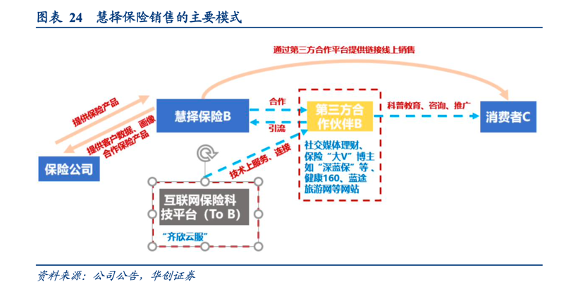

## 基本信息

慧择控股(NASDAQ:HUIZ)是一个互联网保险服务平台。简单说，就是专门帮保险公司卖产品的电商。

### 慧择的销售模式

保险行业有一个common sense，就是"渠道为王"。

慧择的流量主要来自外部推广，如一些网红，第三方合作伙伴（深蓝保）

我不看好慧择的主要原因，优势不够突出，短板很明显

- 没有护城河：主跟互联网巨头主打流量的策略比，慧择现在主打的是高质量的服务，比如理赔协助，高质量人工客服。但是，互联网巨头一旦拿到长险牌照，也是很容易复制的。
- 短板：渠道
    1. 来自网红渠道的流量，抽成多，相对传统线下保险，无销售成本优势。还有一个政策风险，政府打压夸大宣传，也会造成这部分流量变少。
    2. 慧择的第三方合作伙伴，比如深蓝保，未来可能自己发展成保险中介，申请牌照。这样惠泽会丢失一个重要的流量入口，并且多了一个竞争对手。
    

### 销售额和利润

长期和短期看，营收都是稳定上升的。
除了2020年第四个季度，净负债是在逐渐缩小的。

可能是在技术上的投入增加了。

### 管理层

## 行业分析

### 主要销售模式

互联网保险行业，主要有三个销售模式

- 2A2C：面向代理人和c端，eg小雨伞
- 2B2C：eg 慧择，主要靠服务，客单价高。
- 2C：互联网巨头，主要靠走量，客单价低，eg微保，蚂蚁保险

## 公司的亮点

自己研发保险产品

## 风险

商业模式，除了卖保险拿提成， 还有什么其他收入来源？
该行业的进入成本有多高？
相对竞争对手，它的护城河是什么？

哇咔喳这种保险代理平台，现在来看似乎更受欢迎？用户跟用户之间还可以卖保险，有网络效应

## 保险相关专业名词

- 保险机构：包括保险公司（含相互保险组织和互联网保险公司）和保险中介机构；
- 保险中介机构：包括保险代理人（不含个人保险代理人）、保险经纪人、保险公估人；
- 保险代理人（不含个人保险代理人）：包括保险专业代理机构、银行类保险兼业代理机构和依法获得保险代理业务许可的互联网企业；
- 保险专业中介机构:包括保险专业代理机构、保险经纪人和保险公估人。

## 参考资料

1. [2020年财报sec](https://www.sec.gov/Archives/edgar/data/0001778982/000119312521088464/d32761d20f.htm)
2. [近年财报-yahoo](https://finance.yahoo.com/quote/HUIZ/financials?p=HUIZ)
4. [互联网保险系列报告-华创证券](http://pdf.dfcfw.com/pdf/H3_AP202003041375839267_1.pdf)
5.[政策禁健康险夸大宣传](http://www.gov.cn/zhengce/2021-01/14/content_5580017.htm)
6. [互联网保险业务监管办法](http://www.gov.cn/zhengce/zhengceku/2020-12/14/content_5569402.htm)