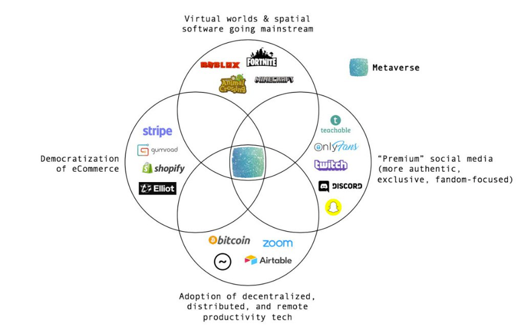

## 整体分析

我不看好慧择，主要原因，未来行业竞争加剧，没有护城河，短板很明显

- 没有护城河：主跟互联网巨头主打流量的策略比，慧择现在主打的是高质量的服务，比如理赔协助，高质量人工客服。但是，互联网巨头一旦拿到长险牌照，这种优势也很容易复制的。
- 短板：渠道
  
    1. 渠道成本高：来自网红渠道的流量，抽成多，相对传统线下保险，无销售成本优势。还有一个政策风险，政府打压夸大宣传。
    2. 慧择的第三方合作伙伴，比如深蓝保，未来可能自己发展成保险中介，申请牌照。这样慧择会丢失重要的流量入口，并且多了一些竞争对手。
    

## 保险相关专业名词

- 保险机构：包括保险公司（含相互保险组织和互联网保险公司）和保险中介机构；
- 保险中介机构：包括保险代理人（不含个人保险代理人）、保险经纪人、保险公估人；
- 保险代理人（不含个人保险代理人）：包括保险专业代理机构、银行类保险兼业代理机构和依法获得保险代理业务许可的互联网企业；
- 保险专业中介机构:包括保险专业代理机构、保险经纪人和保险公估人。

## 基本信息

慧择控股(NASDAQ:HUIZ)是一个互联网保险服务平台。简单说就是互联网保险中介。

## 行业分析

### 互联网保险行业的市场数据

- 股票7只
- 总市值3.5万亿元
- 流通市值2万亿元

### 保险指数表现

2020年跑输大盘

### 参与主体

### 行业的几个主要销售模式

互联网保险行业，主要有三个销售模式

- 2A(agent)2C：eg
- 2B2C：eg慧择
- 2C： 互联网巨头，eg微保，蚂蚁保险

互联网保险中介TOP5的三个阵营:

1) 以 微保、蚂蚁保险为代表的阵营，背靠头部互联网平台，在用户触达方面享有天然的流量 优势;
2) 以水滴、轻松保为代表的阵营，通过众筹、互助的形式吸引、留住用户，用户 黏性较高;
3) 以慧择为代表的独立的保险中介公司，通过互联网软文等方式吸引用户投保。

目前市场上通过教育、科普保险用户销售保险产品，并已经积聚起一定用户规模的独立 网销平台还包括小雨伞、悟空保等。慧择和小雨伞的运营思维较为接近，二者均通过 B2B2C 模式，借助于大 V 和 KOL 的影响力为产品销售引流;悟空保的业务模式带有更 多直达用户的形式，通过投放高质量的保险产品比对、投保指南等文章，教育用户，科 普保险知识，扩大平台影响力。

互联网保险行业，主要有三个销售模式

- 2A2C：面向代理人和c端，eg小雨伞
- 2B2C：eg 慧择，主要靠服务，客单价高。
- 2C：互联网巨头，主要靠走量，客单价低，eg微保，蚂蚁保险

### 行业竞品分析

主要的互联网保险中介平台：

- 慧择
- 悟空保
- 微保
- 小雨伞
- OK车险

## 公司分析

### 运营情况

长期和短期看，营收都是稳定上升的。
除了2020年第四个季度，净负债是在逐渐缩小的。

可能是在技术上的投入增加了。

长期和短期看，营收都是稳定上升的。
除了2020年第四个季度，净负债是在逐渐缩小的。

最近一年，收入停滞不前，营销成本大幅增加

### 管理层

来自互联网，平安财险等

### 公司的亮点

1. 自己研发保险产品
2. 重视服务质量：协助理赔，坚持高质量的人工客服。
（不会亏本吗？）

### 慧择的销售模式

保险行业有一个common sense，就是"渠道为王"。

慧择的流量主要来自外部推广，如一些网红，第三方合作伙伴（深蓝保）

### 风险1-渠道对净利润的影响

间接营销佣金占比远高于直接营销，且近年来有上升的趋势。

当渠道成本率达到 80%时，慧择会出现亏损;在目前约 75%的水平下，慧择可实现微薄的利润
公司后期，只有提升对第三方平台的议价能力，盈利能力才能提升。 这是一个风险点，他的议价的资本哪里来？

### 风险2-未来竞争加剧，没有护城河

商业模式，除了卖保险拿提成， 还有什么其他收入来源？
该行业的进入成本有多高？
相对竞争对手，它的护城河是什么？

哇咔喳这种保险代理平台，现在来看似乎更受欢迎？用户跟用户之间还可以卖保险，有网络效应

## 跟朋友的讨论

哦，慧择 跟 futu/游戏 不一样的地方:
慧择的客单价 很容易到天花板，一个用户买了一个长期险，就不会持续买了吧。
futu或者游戏 的客单价就没有上限。

慧择你可以按照saas来理解，短期股价说不准，但是好的赛道+好的团队，就值得研究

爆发起来就很快？

## 参考资料

1. [2020年财报sec](https://www.sec.gov/Archives/edgar/data/0001778982/000119312521088464/d32761d20f.htm)
2. [近年财报-yahoo](https://finance.yahoo.com/quote/HUIZ/financials?p=HUIZ)
3. [政策禁健康险夸大宣传](http://www.gov.cn/zhengce/2021-01/14/content_5580017.htm)
4. [互联网保险业务监管办法](http://www.gov.cn/zhengce/zhengceku/2020-12/14/content_5569402.htm)
5. [2020中国互联网保险中介服务平台Top10](http://finance.people.com.cn/n1/2020/0916/c1004-31864208.html)
6. [从传统代理人社交圈到更广阔的互联网流量池-202003-华创证券](http://pdf.dfcfw.com/pdf/H3_AP202003041375839267_1.pdf)
7. [从慧择看专业互联网保险中介如何创造增量价值？-202101-华创证券](https://pdf.dfcfw.com/pdf/H3_AP202101051447381631_1.pdf?1609858004000.pdf)
