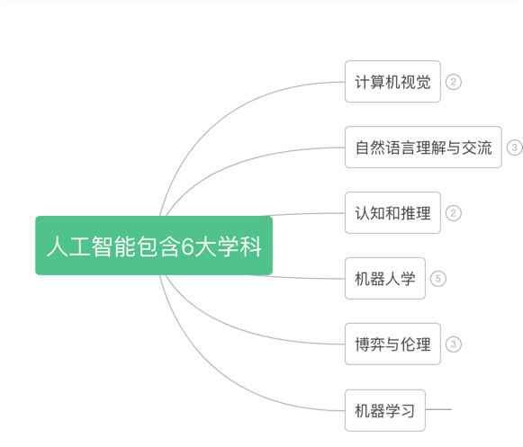
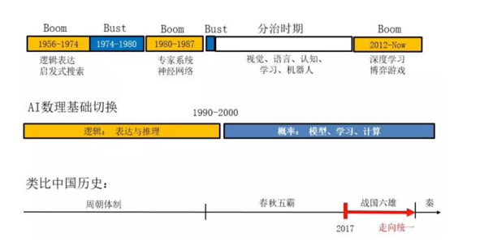
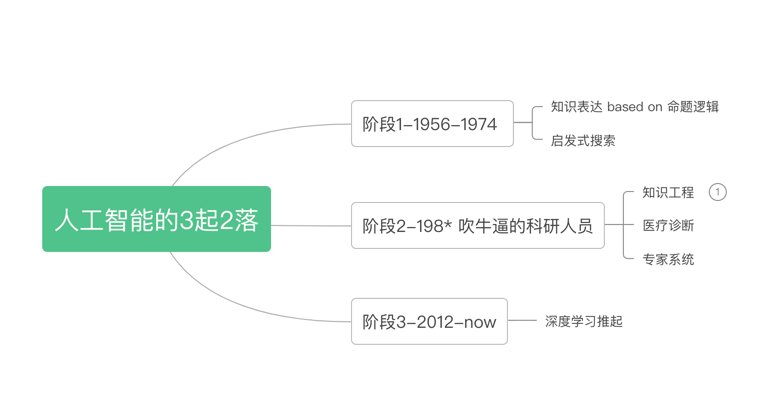
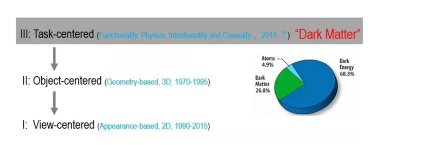
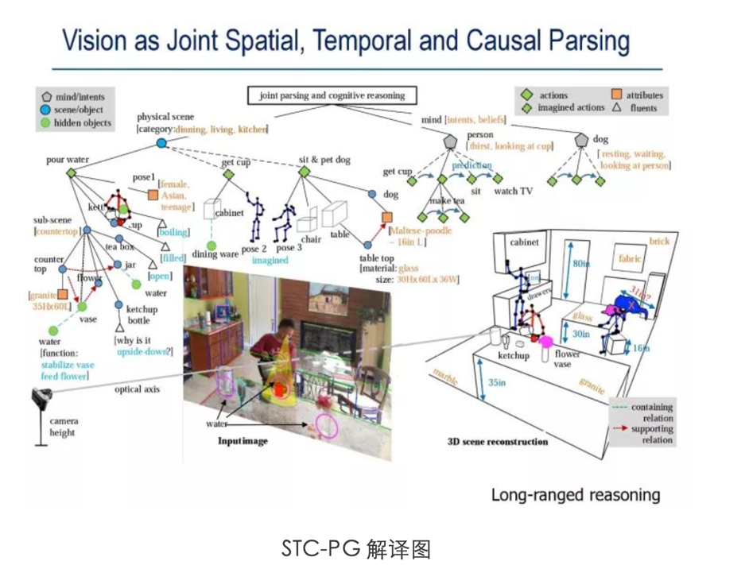

## 引言

1. 比特币不仅是数字货币，还是一个去中心化的信用网络。
3. 步入农耕社会的蚁群：切叶蚁不吃树叶，只利用树叶来培育真菌，这些真菌才是蚁群的主要食物来源。蚁群是一个种性社会，但是没有中央政权，群落中没有领导者，个体没有复杂的结构，然而这个群体却可以产生不可思议的复杂性，这个是自然界给我们的一个启发。
   
   > 当乌合之众要在一个项目中合作时，成功概率极小。蚂蚁和乌合之众的区别是什么？蚁群遵循一定的规则，但是乌合之众却不受约束。
5. 比特币是一个复杂的信用网络，网络中单个节点仅仅遵循几个简单的数学规则，并且不需要很复杂或者信用机制。就是很多个这样的简单的节点构成了比特币网络。像蚁群一样，比特币不需要中心协作却能完成各种不可思议的事情。

## 第1章 欢迎来到比特币的世界

### 什么是比特币

1. 广义的比特币是构成「数字货币生态」的概念和技术组合。
2. 狭义的比特币，是指的一种货币单位，用于存储和传递价值。
3. 比特币用户之间主要通过「比特币协议」在互联网上通信。（互联网协议有点像蚁群之间交换的化学味素--信息素）
4. 比特币可以在专业的货币交易所与其他货币进行兑换；也可以完成一切传统货币的使命-买卖商品，转账，发放贷款。
5. 比特币的挖矿机制使得央行的货币发行和清算机制得以去中心化。???
6. 「比特币协议」规范了去全网挖矿的行为，通过算法控制挖矿速度（全网10min挖到1个block）。协议同样规定，每隔思念，新btc的创建速度将减半，总量在2100万内，大概在2140年达到。长期来看，比特币是维持通货紧缩的。不过反过来看，他是的无法通过"印钞票"导致通货膨胀。
7. 比特币作为货币，只是比特币协议第一个应用，还有可能有更多的应用，比特币生态类似货币的互联网。

### 比特币之前的数字货币

1. 数字货币取得人们信任的两个前提:
    - 防伪：相信货币是真实的，不是伪造的
    - 防止双重支付
2. 为了防伪，纸币的发行者采用先进的印刷技术来印钞。「防双重支付」对纸币来说也不是问题：一张钞票不可能同时在两个地方出现。
3. 传统货币以电子的方式进行转账和存储的时候，如何防伪和防双重支付？央行对电子交易进行集中清算。央行为什么可以做到？因为他拥有货币流通的全局视角。
4. 数字货币没法参考纸币和电子货币，它利用密码学来保障用户财产的安全。「加密数字签名算法」可以解决双重支付的问题。
5. 早期（20世纪80年代），数字货币项目发行的货币，通常由国家法定货币或者贵金属进行背书。但是他们还是中心化的，利用中央清算机构定时处理所有交易，但是很容易成为政府担忧的目标，从而被政府起诉，然后就消失了
6. 为了应对反对势力的干扰（政府or黑客），需要引入去中心化的数字货币系统，like 比特币。
7. 比特币是密码学+分布式系统融合的产物，整个系统包括以下四个部分：

- 比特币协议：去中心化的点对点网络，类似互联网
- 区块链：公共交易账本，类似人人都是清算人员
- 分布式挖矿：去中心化的基于数学的货币发行体系，类似计算机充当央行制定发货币的预算
- 交易脚本：去中心化的交易验证系统。

### 比特币的历史

1. 08年，中本聪发表了一片paper《Bitcoin:A Peer-to-Peer ElectronicCash System》，
主要创新点在于，基于「工作量证明」算法，让分布式计算系统每10min组织一次全局"选举"，使网络形成对交易状态的共识（来～大家一起来对一下账本～），这个机制优雅地解决了双重支付问题，避免了一个货币能被多次消费。之前，双重支付一直是数字货币系统的弱点，不得不引入一个中央清算机构来完成交易清算。
    
    > 为什么需要中央清算机构？我想到一个场景，比如我从招商银行账户转钱到建设银行账户，正常情况下，是从招行扣余额，建行增加余额，但是如果没有清算机构盯着他们，他们俩是不是可以作弊呢？比如招行不扣余额，建行还是增加余额，或者招行还给自己增加余额，这俩银行岂不就是相当于在自己给自己发货币了？？不行，还是得要第三方机构盯着。
2. 比特币网络开始于09年，现在网络的计算能力已经超过了全世界最强大的超级计算机的处理能力。
3. 中本聪自2011年4月起从公众视野中消失,不管是中本聪还是任何其他人均无法对比特币系统进行控制，这个系统只依赖于完全透明的数学法则.
4. 中本聪的发明，也是对之前未能解决的拜占庭将军问题的一个实用的解决方案。拜占庭将军问题可以描述为，如何在一个不可靠且存在潜在背叛风险的网络中，交换信息并且达成共识（非常fit现在社会的状况，没有共识，分化严重）。中本聪的方案：在一个没有中央可信节点的情况下，利用「工作量证明」来达成共识。方案的除了可应用于货币领域，也可用于证明选举，彩票，资产注册，数字公正等活动的公正性。
    
    > 距离本书的出版已经过去了3年，3年期间发生了一些魔幻的事件：特朗普质疑美国总统选举造假，台湾的彩票造假风波，艺术收藏品采用数字货币NFT来注册资产...可能比特币的市场在慢慢成熟的路上

### 比特币的使用，用户，以及他们的故事

> 比特币代表的货币，本质上是人与人之间实现价值交换的语言. 下面使一些数字货币在现实生活中的应用

1. 低价值零售零售：从朋友处获得一些比特币，使用比特币从帕洛阿尔托的鲍勃咖啡屋购买一杯咖啡。
2. 高价值零售：旧金山一家画廊的老板，以比特币计价出售昂贵的画作。高价值零售商面临的51%共识攻击的风险。
3. 离案合同服务：比特币可以在外包、合同服务及国际汇款中使用。
4. 慈善捐款：用比特币进行跨币种和跨国界的筹款过程，以及利用开放账本实现慈善组织的透明化
5. 进出口：用于大型商业机构间基于物理货品的国际支付，无货币兑换成本，交易快速。
6. 挖矿

## 第2章 比特币是如何工作的

### 交易，区块，挖矿和区块链
1. 比特币由用户，交易和矿工组成

> 矿工不挖矿怎么办？集体要求涨工资怎么办？
2. 用户拥有钱包，钱包里面有密钥；交易在网络上传播；矿工来记账，通过创建共识区块链。
3. 比特币交易：就是告诉网络，某个拥有一定数量比特币的用户已经授权将这笔BTC转让给另外一个用户。比特币的新的所有者可通过另外一笔授权，转让交易，来使用这些比特币。以此类推，形成一个所有者转换的链条
> 转换链条中，会不会标识比特币的id？有没有必要？
4. 1个交易包含多个输入和输出"输入表示借方，输出表示贷方，一般来说，借出价值略大于贷方得到的价值，中间的差额会给到记账的矿工，类似现实生活中，存款和贷款利息差是孝敬银行的。
5. 1个交易还包含借方对带转让btc的所有权证明：该证明以「所有者数字签名」的方式表示，可以被任何人独立验证。
6. 交易将价值从交易输入转移到交易输出。交易输入是价值的来源，通常是上一笔交易的输出。交易输出将一笔与私钥关联的价值赋予一个新用户。目标密钥称为安全锁。在未来的交易中，需要通过签名来获取这笔资金。一笔交易的输出作为新交易的输入，这样，随着价值不断从一个地址转移到另一个地址，就形成了一条所有权的链条（见下图2.4）。

> 如果中间alice要买一个奢侈品，say要1个BTC。这个交易的输入是不是要有多个输入token。
7. 实际中常见的交易形式：输出方要找零；大额交易要从多渠道凑钱（资金归集交易）；一个输入分配给多个输出（资金分配交易，eg给员工发工资）。

### 创建交易

1. 用户只用指定接受人和交易金额，钱包软件知道如何选择合适的输入和输出。
2. 创建交易和签名不需要在连接到比特币网络的情况下进行，只有在执行交易时才需要将其发送到网络。创建交易就想在家里写一张支票。
3. 钱包软件是怎么运作的呢？创建输入和输出的？
4. 钱包软件先找到足以支付对方资金的交易输入。大部分钱包软件会保留一个"为话费的交易输出"的小型数据库。完全客户端存有网络上所有交易的"为未花费输出"，钱包软件只存自己的, 有需要的话可以想毕业币网络询问信息（使用供应商提供的api）。如果这个条件不能满足，钱包软件就不得不去翻找所有的小额未花费输出，凑够这笔交易输入。
5. 创建输出：交易输出以脚本的形式创建一个针对特定价值的受限，只有通过解决脚本问题来解除受限，才能兑现这笔输出。爱丽丝的交易输出包含一个脚本，脚本大意是这样的：“这个输出将支付给那个能提供与鲍勃的公开地址相匹配的签名的人。”由于只有鲍勃拥有与其地址匹配的密钥，所以只有鲍勃的钱包软件可以提供这样一个签名来兑现这笔输出。爱丽丝以要求提供签名的方式，锁定了一笔输出价值。
6. 添加交易费用：为了使这笔交易尽快被网络执行，爱丽丝的钱包应用将添加一小笔的交易费用。
7. 交易结果可以通过一种叫作区块链浏览器的web应用来查看，结果如图2.8所示。
   
8. 发送交易:创建完交易后，还要发送到网上，使这个交易变成分布式账本（区块链）的一部分
任何比特币网络节点（其他客户端）接收到之前未见过的有效交易时，将立即将其转发给与它相连的其他客户端。这样，交易就很快在这个点对点网络中传播开来，在短短几秒内即可到达大部分节点。
9. 贷方视角：借方创建的交易发送至借方的钱包时，借方钱包先去验证这笔交易是否有效，输入是否是之前未消费的输出（防双重支付），以及交易费用是否能覆盖下个区块，

### 比特币挖矿

1. 比特币被传播到了网络中，还需要被确认并且通过挖矿，才能成为共享账本（区块链）
的一部分。
2. 挖矿在比特币系统中有两个目的：挖矿过程在每个新区块中尝艰辛的毕业币，就想央行发行货币。每个区块创建的新比特币数量是固定的，随着时间推移，数量会逐渐减少/
3. 挖矿过程创造信用，需要确保只有足够算力投入到包含这些交易的区块后，交易才能得到确认。更多的区块意味着更多的计算量投入，也意味着更多的信用。

### 交易区块挖矿

1. 新交易不停地从用户的钱包或者其他应用中流入网络。当这些交易被其他节点捕获时，就会被加入一个各自维护的临时未验证交易池中。矿工创建新区块时，他们将未验证交易池中的交易取出，并入新建区块，然后尝试解决一个极为困难的问题（即工作量证明）来证明这个区块的有效性。
2. 矿工首先创建一个新区块，填上交易以及上个区块的指纹，然后开始计算这个新区块的工作量证明。矿工还会在区块中包含一个特殊的交易，这个交易向他自己的比特币地址发送一笔新创建的比特币作为奖励（当前每区块25比特币[插图]）。
3. 你可以通过http://blockchain.info/block-height/277316查看包含爱丽丝交易的区块。
4. 由于新区块一个个叠加在原有区块之上，这使得推翻原有交易的难度呈指数级增长，这样就保证了交易可信程度越来越高。
5.爱丽丝交易的第277316号区块。在它之下有277316个区块（包括0号区块），这些区块互相连接，直到0号区块——被称为创世区块，形成一个区块的链表（区块链）。
按照惯例，任何经过6次确认后的区块即被认为是不可撤销的，因为要撤销并重新计算6个区块需要极大的计算量.

### 花费交易
1. 完全客户端可以从比特币在区块中创建的时刻起，跟踪这笔资金的流转过程，直到它们到达鲍勃的地址。轻量级客户端只能确认交易是否在区块链中，有几个区块在它之后被挖出，从而获知网络已确认它的有效性并接受它.
2. 鲍勃可以用爱丽丝买咖啡的钱来支付承包商或供应商的费用。大多数情况下，鲍勃的比特币软件需要归集多个小的支付交易才能完成一笔较大的支付，或是将一天的比特币收入集中到一个交易中。
3. 当鲍勃将从爱丽丝及其他客户收到的款项花出去的时候，他扩展了交易链条。结果是，新的交易加入全局区块链账本中，所有人都可见并获得信用。我们假定鲍勃向他的网站设计师——班加罗尔的高佩什支付新网页的设计费用。现在交易链条看起来就像图2.10这样。

   
## 第3章 比特币客户端（略）

## 第4章 密钥，地址，钱包（略）

## 第5章 交易
6
## 第6章 比特币网络
11
## 第7章 区块链
8
## 第8章 挖矿与共识
12
## 第9章 替代链，替代币 应用程序
5
## 第10章 比特币安全
2

## 参考
1. http://bit.ly/mastering_bitcoin
2. [区块链：通往资产数字化之路-微信读书](https://weread.qq.com/web/reader/6c4321805e3c8a6c44811dck16732dc0161679091c5aeb1)