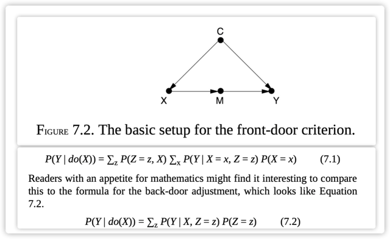

> the book of why 的第6章-一些悖论

## 悖论1-蒙提 霍尔

### 背景
一个竞猜游戏中，有三个用幕布遮住的们，其中有2个门后面是山羊，1个是汽车。有两种游戏规则，分别是：

1. 观众先选择三个门中的一个，然后主持人从另外两个门中选择一个没有汽车的们打开，然后这个观众可以选择要不要换门？
2. 观众先选择三个门中的一个，然后主持人从另外两个门中随便选一个打开，然后这个观众可以选择要不要换门？

第一种强况下，选择换门的话，赢到车车的概率是2/3，
第二种情况下，选择换门的话，赢到的车车的概率是1/2

### 悖论的原因

1. 贝叶斯公式可以解释信息在非因果关系上的流动，也就是规则1，主持人选择了没有汽车的之后，第三个门的不确定性降低了（沿着门后有车的概率变大的方向），而整个空间的概率之和为1，所以第一个门有车的概率变小了。

    > 主持人的这个决策带来了系统的熵减，系统坍塌到2号门某个确定状态的子空间去了。
2. 为什么直觉上很难接受规则1的结论，反而会认为比赛的机制不公平？这个跟人类大脑结构有关系：

    - 大脑不擅长处理概率问题，
    - 大脑自发抵制非因果关系的信息传递，这个是贝叶斯式变量控制的产物。
    - 习惯将相关性等同于因果性
    - 大脑天生难以接受

## 悖论2-伯克森悖论

1. 生物统计学家约瑟夫.伯克森在医院做实验时，观察到了一个现象：两种疾病本来在一般人群中毫无关联，但是在住院人群中却会观察到似是而非的相关性。
2. 医院样本实际上是一个冲撞模型，即，当一个人同时患了两种疾病时，一定会住院。
3. 所以，「医院样本」就好像一个经过精心挑选过的样本，体现出来的相关关系是控制了「住院」变量之后，疾病1和疾病2的伪相关性。
   
4. 1956年，哲学家赖欣巴提出了一个猜想「共因原则」（common cause principle），他认为没有不含因果关系的相关关系，即，X和Y的相关不是偶然发生的，要么是一个变量导致另一个变量，要么是第三个变量，比如说出现在两个变量之前的Z变量，导致两者发生。
5. 设计一个抛硬币的实验就可以推翻「共因原则」：假设同时抛两枚硬币，抛100次，只记录其中至少又一枚硬币为正面的结果，实验结束，发现记录的75条记录中，发现只要硬币1反面，硬币2就是正面，是因为两个硬币互通消息了吗？不是的，是因为人为记录改变了测度空间。
6. 还有一个社会现象就是，在一些调查中发现，跟你约会的人中，哪些又魅力的人往往是混蛋。这个也是因为测度空间被你亲手改变了，因为长得丑的渣男最开始就被你过滤了。过滤之前，有魅力的渣男的概率是1/4，过滤之后有魅力的渣男概率是1/3。所以感觉这个比例增加了。

## 悖论3-辛普森悖论

1. 辛普森逆转：一个叫辛普森的医生，在文献上发现了一种新药D，可以治疗心脏病。论文的实验数据显示，女性患者服用药物之后，心脏病发作比例升高；男性患者服用药物之后，心脏病发作比例也升高。但是，在整体人群上，心脏病发作比例却降低了，因此该药物也被归为BBG（BAD/BAD/GOOD）型药物。然而，实际上这种药物不存在，虽然说在数学上没有什么问题。
   
2. 对整体人群来说，正确的结论应该是什么呢？可以这么操作，先控制性别：
   - do（性别）=女性，计算女性服药之后心脏病发作比例的变化 r1。
   - do（性别）=男性，计算男性服药之后心脏病发作比例的变化 r2。
   - 假设整体人群中，男女比例为1：1，那么可以推断出整体人群，服药之后，心脏比发作比例的变化为（r1+r2）/2
3. 辛普森悖论是因为混杂因子的存在。
4. 当我们考察两个变量的因果效应时：
   - 如果存在混在因子，只能用分层数据计算因果效应，采用控制混杂因子的方式，case by case，计算每个混在因子取值的情况下，两个变量的因果关系，然后按照混杂因子每个取值的概率汇总，得到整体上，两个变量之间的因果关系。
     
   - 如果不存在混杂因子（有可能存在中介物），可以用聚合数据计算因果效应
   
5. 混杂因子存在的警告：根据聚合数据估计出来的因果效应大于，根据分层数据估计出来的因果效应。

## 关于悖论

1. 什么是悖论？绝大部分人深信不疑的两个信念之间的冲突。
   
   > 辛普森逆转并不算悖论，只是纠正了不懂数学的人，对"平均表现"的错误认识。
2. 如何解决悖论？
   1. 理解为什么大多数人会把它看成一个悖论？or大家对世界的直观看法到底在哪里存在重大缺陷？eg生理结构原因：大部分人不擅长处理概率问题；「过分擅长」处理因果问题
   2. 如何纠正：刻意训练，完成大脑重塑。

## 参考

1. [the book of why-微信读书](http://bayes.cs.ucla.edu/WHY/why-intro.pdf)
