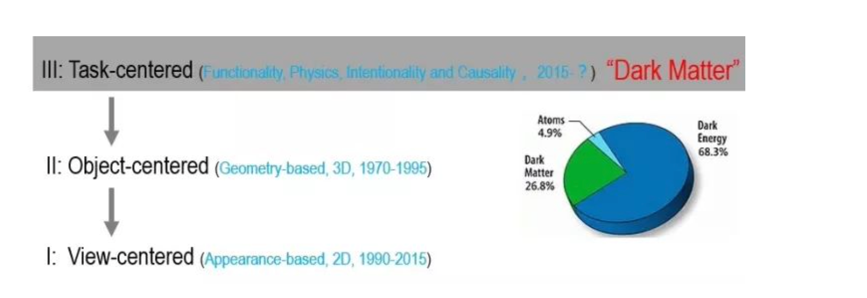

> 曹興誠 論佛教的科學性 於靜思書軒心靈講座

## 二十个字谈佛法

二十字是“闻、思、修；体、相、用；缘起性空、真空妙有；禅修、平等、慈悲”。

1. 科学和技术怎么看待因果？科学是由果推因，技术是依因求果。
   (王德峰说的由实际 得到 真际 就是科学，在真际中推演，就是希腊人的数学，--毕达哥拉斯学派)
   

2. 空性---缘起性空

什么是空？就是变，不是没有的意思

幻是什么？无常
「无执着」是什么？有弹性
「无自性」：不由自主

3. 八不中道

- 不生不灭：没有东西，能不经缘而生/灭。
- 不断不常：不是突变（宇宙大爆炸就是突然的吧），没有恒定不变。
- 不一不异
- 不来不去

4. 宇宙只有能量和规律，此外空无一物
所有物质都是靠能量（缘）的聚集。

5. 人是能量的转换器；
万事万物都在变化；--有为法
只有规律是不变的。--无为法

6. 金刚经中说圣贤跟一般人的区别，对无为法的认识

7. 佛教也是一种塑造认知的工具

8. 小乘佛教 的离苦得乐的方法：

9. 真空妙有
真就是"很"的意思

弹钢琴：遵循一定的乐理规律，音符千变万化

10. 大乘佛教是入世的；小乘佛教是避世的

小乘时代著重空性（变化），觉得追求会落空，不如回去禅修，‘小乘就是让大家从社会撤退，出家才能静下心来，小乘时代是遁世。’

反之，大乘时代认为‘空’不错，真空则妙有，火是空性的，空性才有用，否则烧起来不熄（不变化），那就糟了，‘会变化才有用，弹性愈大愈有用。大乘认为加善缘以提升，人变成佛，开始强调人人具有佛性、人人可以成佛，用真空妙有积极地入世。’

11. 万法唯识论：
改变看事物的角度，你的了解也会变，感觉和心情也会变化。
心 跟 物 是有关联的

12. 霍金：心里面形成很多观念, 也就是内部构建model。（换个角度，构建的模型不一样）

    波尔：物理学不是用来发现这个世界长什么样，物理学家关心的是怎么解释他。

  （科学家的model和普通人的model是一个东西么？不是。科学是一个观察世界的角度么？是。）
    

13. 意识是什么？

- 心智是什么？蚊子躲你, 蚊子是有心智的
- 清醒：打麻药就不清醒
- 核心自我：脑干以下的部分，具有稳定性，接近无为法，不生烦恼
- 自传体自我：大脑皮层的活动，不断修正的过程，充满烦恼。

《意識究竟從何而來？》

14. 区分核心自我和自传体自我
净心/真心/心真入门：核心自我
染心/妄心/心生灭门：自传体自我

15. 禅修的原理

五个毒素怎么混入自传体自我？社会的风气，社会传导的价值观，让二元对立

人生来是无知，愚蠢（贪嗔痴）是后天的教育的结果---罗素

「不二之性就是佛性」，不要去区分高低好坏得失。

禅修就是要关注核心自我，比如数呼吸，转移注意力，停止妄念。

觉性：打开五官，感受这个世界
走路就可以禅修，注意自己的脚步

16. 佛教需要思考和修正

一个事物：体（心），相（外表），用（途）。

‘体相用’是指万物皆有一体三面，本质是体，外面是相，每种相有其用途；而人的本体是心、外表是相，以相出现在社会上，相是虚妄的，各有其用途。

## 参考

1. [曹興誠 論佛教的科學性 於靜思書軒心靈講座](https://www.youtube.com/watch?v=9yCa6Iyo41A)
2. 《世界上最快乐的人》
3. 《禅悦在当下》