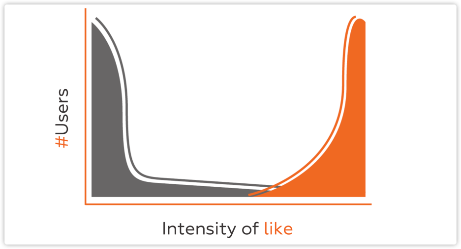

> 斯坦福YC创业公开课——
> 这门课由Y－Combinator新任掌门人Sam Altman发起，将邀请多位硅谷大牛授课，包括创业教父Paul Graham, 风投大咖Peter Thiel, Reid Hoffman, Marc Andreesse等等，课程将讨论如何寻找创业好点子，并对其进行评估，如何吸引用户和增长用户，如何做销售和市场营销，如何招聘员工，如何筹集资金，企业文化，经营管理，经营策略等。
> http://startupclass.club/

1. 创业四要素：idea，product，team，Execution
2. 市场很重要，要从长远的变动的角度看市场，现在规模很小，以后可能会大
2. idea哪里来？根据自己的需求创造一些东西，这种方式比对用户调研，强很多。
   如果你自己都不懂这玩意儿，而是创建的别人需要的一个东西，记住，你处于一个巨大的弱势之中，所以你需要非常非常贴近你的用户，尝试着跟你的用户在一起工作，或者一天之中和他们多次交谈。如果你不能很清楚得解释你的idea，这个是一个信号--你的idea过于复杂，你的idea应该能通过少数几个word，非常清楚，有条理地表达出来。
   
    

## 参考
1. [bilibili](https://www.bilibili.com/video/BV13K4y1b7yE?t=703)
2. [YC创业公开课-slide](https://www.dropbox.com/s/uio0cep4a2454ar/Lecture_1_Sam.pdf?dl=0)
3. [sam altman的播客](https://blog.samaltman.com/)
4. 