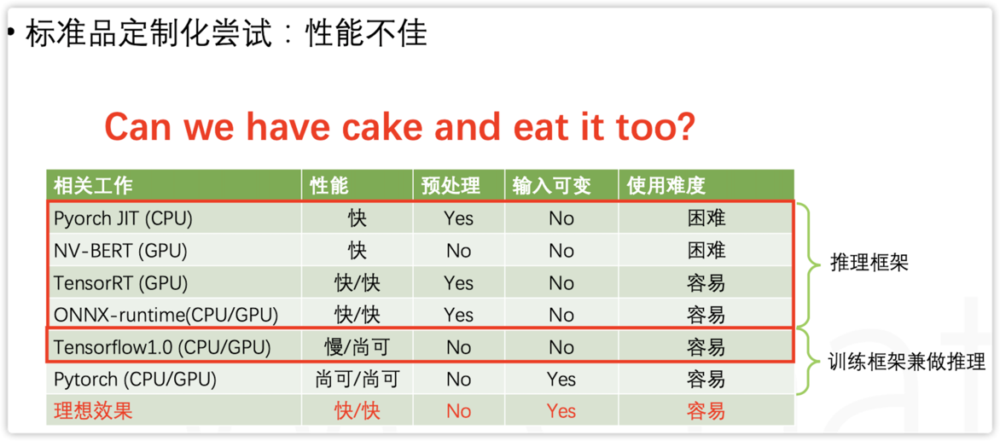

> 「贝叶斯优化」技术是求解黑盒最优化问题的一种方法，该技术可拓展到自动调参的场景中。
> 
> 接下来从直觉的角度，描述「贝叶斯优化」的思路
>
> 效用函数是我对采集函数（acquisition function）的意译，得「意」可忘形，没必要扣字眼。

## 背景

什么是「黑盒优化」？

求解 
$$ \max _{x \in \mathcal{X}} f(x)$$
但是$f(x)$的内部运行机制，我们一无所知，即$f(x)$对我们而言就是一个黑盒

## 技术选型

### 进一步明确问题
「自动调参」（或者「超参转化」）本质上就是在求解一组最优的超参数，使得这组超参在样本集上的效果最好。
这个需求可以抽象为一个典型的黑盒优化问题，即
$$ \max _{x \in \mathcal{X}} f(x)$$

- x代表一组超参数的取值，是一个向量，每个元素代表一个超参数，一个算法可能包含成千上万个超参数。
- f(x)代表一组超参数取某个值时，模型的准确率）。

模型越复杂，超参数就越多（即x里面的元素越多），调参的工作就越依赖经验，并且也非常耗时。

调参的过程中存在的痛点：极其依赖算法理论和工程经验，调试过程繁琐。

那么有没有什么技术能将人力解放出来呢？

有的，目前比较常用的思路有贝叶斯优化算法（Bayes Optimization），随机搜索，网络搜索, 以及贝叶斯优化的变形（SMAC和TPE）

### 候选方案

先看随机搜索 和 网格搜索

- 网格搜索和随机搜索: 
  

  - 网格搜索：如左图，需要指定搜索范围和间隔， 优点：考虑到了搜索空间内所有的参数组，缺点：存在组合爆炸的问题.
  - 随机搜索：意思是，在超参空间进行随机采样，将采样得到的超参作为best guess。如右图，采用随机采样的方式得到新的超参。优点：容易理解。缺点：可能搜索不到最优的超参.

- 贝叶斯优化: BayesOptimazation(r，p, m，n_iters，算法名称，
	- 优点：不需要指定搜索范围，效果优于随机搜索
  
- 贝叶斯优化的变形-SMAC和TPE
  
	- SMAC：代理函数变成了回归随机森林
	- TPE：代理函数变成了高斯混合模型
	

## 贝叶斯优化概述

### 文字版 

贝叶斯优化算法（Bayes Optimization），它的大概思路是这样的：

1. 收集样本<x,f(x)>，x是一组超参，f(x)表示这组超参下，训练出来的模型的准确率。
2. 使用样本<x,f(x)> 拟合一个高斯过程回归器（GaussianProgressRegressor）
3. 基于高斯过程回归器构造一个acquisition函数,用来衡量超参数空间中，当前每个区域的潜在收益。一般来说acquisition函数就是均值加上n倍方差（Upper condence bound算法）。
4. 搜索acquisition函数的最大值，即最值得探索的点（Next Best Guess）。
5. 将找到Best Guess（一组超参）带入原来算法，重新训练一遍，并记录下此时模型的准确率。
6. 将5得到的新样本数据加入样本集中，回到第二步，进行下一个迭代，循环往复，直到模型的准确率没有提升或者达到最大的迭代次数。

### 图形版

https://distill.pub/2020/bayesian-optimization/
上图中

- 横轴是超参，
- 上面图的纵轴：超参数取不同值时，模型的准确率。 
  - 黑色的线代表拟合出来的均值线，灰色区域代表拟合出来的置信区间
  - 红色的线代表超参和准确率的真实关系 红点代表下一次要探索的点
- 下面图的纵轴：超参数取不同值时，采集函数的值，取值越大，表示该区域越有可能存在最优超参。

## 贝叶斯优化细节

调参的过程中存在的痛点：极其依赖算法理论和工程经验，调试过程繁琐。那么有没有什么技术能将人力解放出来呢？
有的，目前比较常用的思路就是贝叶斯优化算法（Bayes Optimization），它的大概思路是这样的：

为了求解该问题：
$x^{*}=\arg \max _{x \in \mathcal{X}} f(x)$

1. 收集样本$<x_i,f(x_i)>$，x是一组超参，f(x)表示这组超参下，训练出来的模型的准确率。
2. 使用样本$<x_i,f(x_i)>$拟合一个高斯过程回归器（GaussianProgressRegressor）$\hat G$
3. 基于$\hat G$构造一个效用函数。效用函数是用来衡量当前的超参数组成的空间中，探索每个区域的潜在收益或者效用（注意我们的目标是，找到$x_\star$，使得f(x)取到最大值）。 最简单的acquisition function就是均值加上n倍方差（Upper condence bound算法）。
4. 利用效用函数,我们去找最值得探索的点（Next Best Guess）
5. 将找到的最佳的超参组合带入模型重新训练一遍，并记录下此时模型的准确率。$<x_j,f(x_j)>$
6. 将5得到的新样本数据加入样本集中，回到第二步，进行下一个迭代，循环往复，直到模型的准确率没有提升。

### 代理函数

代理函数，就是对黑盒模型性能的评估函数。
原始的贝叶斯优化算法，使用的是高斯过程，后面一些变形就变成了其他的算法。

### 采集函数

怎么采集下一步要探索的超参？两种采样思路：探索(exploration)与利用(exploitation)。

采集函数（acquisition function）即综合考虑了两种因素，对值得探索的超参的空间，给予高估值。

### 难点1-离散变量

贝叶斯优化本身只适用于连续变量，但是实际上很多模型地参数都是离散的，那么如何解决呢？ 直觉上来说，有两个思路:

1. 层次的混合搜索：整形参数采用网格搜索或者随机搜索
2. 贝叶斯模型：在连续空间搜多到best guess之后，截断成整数，加工成样本，然后送入下一次迭代

## 参考资料

1. [贝叶斯优化-通俗版-tobe-知乎](https://zhuanlan.zhihu.com/p/29779000)
2. [贝叶斯优化-技术版—Dai Zhongxiang-知乎](https://zhuanlan.zhihu.com/p/76269142)
3. [贝叶斯优化-可视化版-distill](https://distill.pub/2020/bayesian-optimization/)
4. [开源工具-Advisor-github](https://github.com/tobegit3hub/advisor)
5. [谷歌的调参工具](https://cloud.google.com/ai-platform/optimizer/docs/overview)
5. [csdn](https://blog.csdn.net/xys430381_1/article/details/103871212)
6. [jianshu](https://www.jianshu.com/p/3587b24f1a6d)